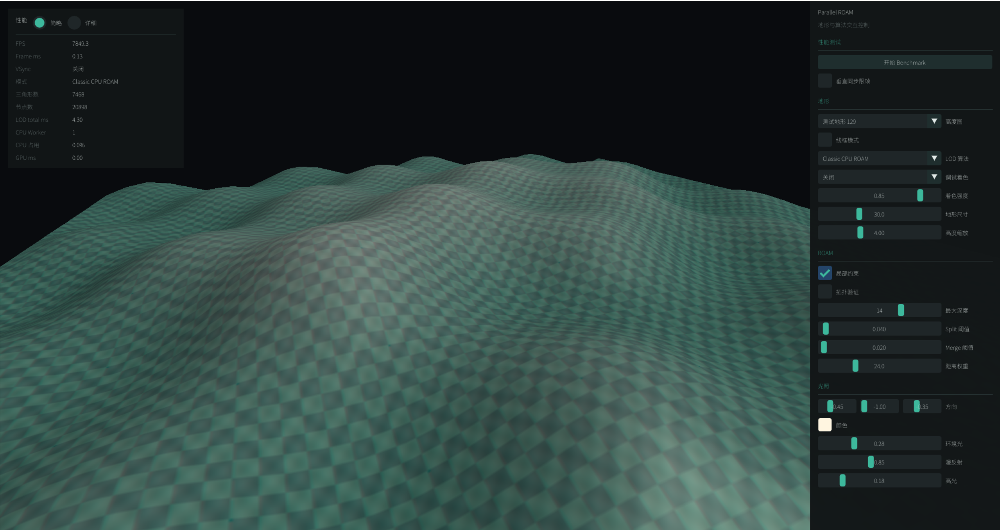
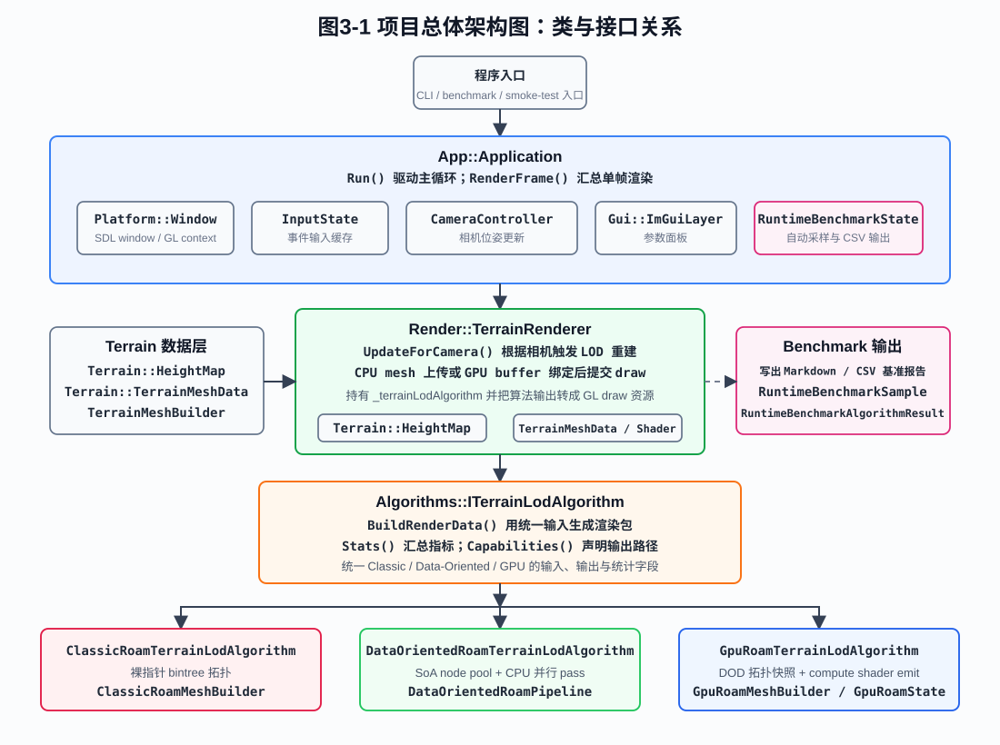

# 面向固定拓扑预算的 GPU 自适应网格细分：兼容闭包感知的全局资源分配

本项目是一个面向高度图地形的自适应网格细分研究与实验平台。项目以自研的 Classic ROAM、Data-Oriented CPU ROAM、GPU ROAM-like 工程实现与优化和论文 CBT 2024：Large-scale Adaptive Mesh Refinement on the GPU(以下简称“CBT 2024”) 为对照路径，正在研究固定拓扑容量下兼顾视觉收益、兼容闭包成本与 GPU 并行性的全局资源分配方法。

> **研究状态：进行中。** ROAM 对照平台、统一误差口径、固定预算、拓扑验证、双图形后端和阶段化 benchmark 已可运行；CBT 2024 的复现计划中，当前已完成 OCBT、基础二分器状态和程序化间接绘制。标题中的“兼容闭包感知全局资源分配”依旧等待探索、实现和验证。



## 项目简介

CBT 2024 以及相关工作中已经体现，动态 GPU 拓扑的执行流程通常可以通过原子计数保证不超出内存池预算，但这并不等价于有限资源被分配给了最重要的细分候选，其也是 CBT 2024 尚未完成的工作。当候选需求超过容量时，先到先得的提交顺序可能产生优先级倒置。与此同时，一次 split 可能需要沿邻接关系传播强制细分，多个候选的兼容闭包还可能互相重叠。

本项目研究的问题是：

> 在固定二分器容量和实时 GPU 时间约束下，能否考虑兼容闭包的依赖、重叠与真实成本，对 split/merge 进行全局预算感知分配，从而在保持无裂缝拓扑的同时在有限预算中选择最优待拓扑节点候选池，从而优化最终拓扑效果？

若候选 `i` 的预测收益为 `g_i`，兼容闭包为 `P_i`，选择集合为 `S`，则实际拓扑成本是：

```text
cost(S) = | union(P_i), i in S |
```

项目的研究目标是设计一种严格不超预算、闭包完整、可解释且适合 GPU 并行执行的近似调度方法。

## 研究假设

项目围绕以下可证伪假设展开：

| 假设 | 验证目标 |
| --- | --- |
| H1 质量 | 相同活动三角形数或二分器容量下，降低最大值与 P95 屏幕空间误差 |
| H2 预算 | 共享闭包去重减少保守预留造成的空闲，并保持内存超额量为零 |
| H3 调度 | 稳定优先级与确定性分配减少原子竞争造成的优先级倒置 |
| H4 性能 | 候选评分、闭包分析、选择与提交的额外 GPU 成本不抵消质量收益 |
| H5 动态性 | 池饱和时，低损失 merge 与高收益 split 的交换能更快适应视点变化 |

详细的继续条件、停止条件和实验设计见[研究假设与验证计划](docs/parallel-roam/12-research-hypothesis-validation-plan.md)。

## 当前实现

### 算法路径

| 路径 | 数据与执行方式 | 当前能力 | 边界 |
| --- | --- | --- | --- |
| Classic CPU ROAM | 对象式节点、裸指针 bintree、串行优先队列 | split、forced split、diamond merge、视锥感知、固定 leaf 预算、CPU Mesh | 每帧仍有全量扫描/emit，不是论文 persistent dual queues |
| Data-Oriented CPU ROAM | SoA 节点池、索引邻接、活动集合、批量 pass 与条件并行 | 与 Classic 共享质量合同；融合 leaf 扫描、误差评估和候选标记 | 拓扑依赖限制并行度，最终仍生成 CPU Mesh |
| GPU ROAM-like | CPU DOD 持久拓扑快照 + compute shader | GPU leaf compaction、误差评估、候选标记、单轮 split、mesh emit、indirect draw | 混合管线；GPU merge 只评分不提交，GPU split 不回写 CPU 持久真值 |
| CBT 2024 | D3D12、OCBT 位域/归约树、GPU 基础二分器资源 | 四档 OCBT、基础拓扑、程序化间接绘制及专项验证 | 动态 split/merge、兼容传播和高度图自适应路径尚待实现 |
| 闭包感知预算调度器 | 计划中的独立研究变体 | 研究问题、假设、基线和验收标准已定义 | 尚未实现；必须在忠实 CBT 基线冻结后开展 |

### 统一质量口径

三种 ROAM 路径当前共享：

- 论文公式 (1) 的 nested wedgie thickness 预计算；
- 论文公式 (2)/(3) 的保守屏幕空间投影；
- wedgie 穿越 near plane 时的人工最大优先级；
- 完整 `ViewProjection`、drawable width/height 和六平面视锥输入；
- 像素单位的 split/merge 双阈值；
- 活动 leaf `TriangleBudget` 上限；
- forced split、diamond merge 和可选拓扑验证；
- 平坦区域的独立 projected edge-density 扩展。

### 工程能力

- C++20、CMake 与 SDL2 应用框架；
- OpenGL 4.3 和 D3D12 双渲染后端；
- Dear ImGui 参数、LOD 调试着色与阶段化性能面板；
- CPU Mesh、GPU buffer 和 indirect draw 统一渲染包；
- Classic、DOD、GPU compute 基于 ITerrainLodAlgorithm 统一输入输出与更新流程 的 ROAM 算法及其变体 的实现与工程优化；
- Classic、DOD、GPU compute 的 ROAM 逻辑阶段统计；
- 自动相机路径 benchmark，输出中文 Markdown 与逐帧 CSV；
- CTest、预算重入测试、GPU smoke test 和 CBT 专项 smoke test；
- 拓扑预算、邻接、T-junction 和资源契约检查。



## 快速开始

### 环境要求

- C++20 编译器；
- CMake 3.24 或更高版本；
- OpenGL 4.3 驱动，或 Windows D3D12 环境；
- Shader Model 6.6、64 位整数运算能力；
- Visual Studio C++ 工具链和 Windows SDK。

仓库包含 SDL2、GLM、GLAD、Dear ImGui、stb 和 Windows portable CMake。普通 preset 会优先使用系统包，再使用项目内 `third_party`，默认不主动联网。

### OpenGL

```powershell
.\tools\cmake\bin\cmake.exe --preset relwithdebinfo-fetch
.\tools\cmake\bin\cmake.exe --build --preset relwithdebinfo-fetch --parallel
.\build\relwithdebinfo-fetch\bin\ParallelROAM.exe
```

也可以使用快捷脚本：

```powershell
powershell -ExecutionPolicy Bypass -File scripts/run_relwithdebinfo_fetch.ps1
```

### D3D12

D3D12 构建固定使用项目指定版本的 Agility SDK 和 DXC。若本地固定依赖尚未准备，先运行：

```powershell
powershell -ExecutionPolicy Bypass -File scripts/setup_cbt_dx12_dependencies.ps1
```

然后配置和运行：

```powershell
.\tools\cmake\bin\cmake.exe --preset relwithdebinfo-d3d12-fetch
.\tools\cmake\bin\cmake.exe --build --preset relwithdebinfo-d3d12-fetch --parallel
.\build\relwithdebinfo-d3d12-fetch\bin\ParallelROAM.exe
```

依赖版本、离线策略和平台差异见[依赖配置说明](docs/parallel-roam/10-dependency-setup.md)。

## 交互操作

| 操作 | 输入 |
| --- | --- |
| 前后左右移动 | `W` / `S` / `A` / `D` |
| 上升/下降 | `Space` / `Ctrl` |
| 加速移动 | `Shift` |
| 旋转视角 | 按住鼠标右键并移动 |
| 退出 | `Esc` |

右侧面板可以切换高度图、线框、LOD 算法和调试着色，并调整 `TerrainSize`、`HeightScale`、`MaxDepth`、`Split/Merge threshold (px)`、`TriangleBudget`、局部约束、拓扑验证与光照参数。

## 测试与验证

运行 CTest：

```powershell
.\tools\cmake\bin\ctest.exe `
  --test-dir build\relwithdebinfo-fetch `
  -C RelWithDebInfo `
  --output-on-failure
```

常用自动验证入口：

```powershell
# 窗口、资源和基础渲染
.\build\relwithdebinfo-fetch\bin\ParallelROAM.exe --smoke-test

# GPU ROAM-like：32 帧 compute、compaction、emit 和 indirect draw
.\build\relwithdebinfo-fetch\bin\ParallelROAM.exe --gpu-smoke-test

# D3D12 CBT 专项验证
.\build\relwithdebinfo-d3d12-fetch\bin\ParallelROAM.exe --cbt-ocbt-smoke-test
.\build\relwithdebinfo-d3d12-fetch\bin\ParallelROAM.exe --cbt-base-topology-smoke-test
.\build\relwithdebinfo-d3d12-fetch\bin\ParallelROAM.exe --cbt-procedural-smoke-test
```

当前单元与结构测试覆盖 nested wedgie、保守屏幕投影、D3D/OpenGL 视锥约定、CBT occupancy tree、基础 bisector topology、Classic/DOD 预算重入及 C++ 注释覆盖率。

## Benchmark

### 无窗口算法回归

```powershell
.\build\relwithdebinfo-fetch\bin\ParallelROAM.exe `
  --benchmark `
  --algorithm all `
  --profile standard
```

可选算法为 `classic|dod|gpu|all`，profile 为 `smoke|budget-reentry|standard`。无图形上下文时 GPU 路径可能被跳过；该入口主要用于 Classic/DOD 正确性与固定轨迹回归。

### 应用级运行时实验

```powershell
.\build\relwithdebinfo-fetch\bin\ParallelROAM.exe --runtime-benchmark
```

运行时 benchmark 会在同一配置和相机路径下依次采样可用算法，关闭 VSync，并在 `benchmark-output/` 生成：

- `runtime-benchmark-<timestamp>.md`：中文汇总和阶段对比；
- `runtime-benchmark-<timestamp>.csv`：逐帧原始数据。

可通过 `--runtime-benchmark-heightmap`、`--runtime-benchmark-terrain-size`、`--runtime-benchmark-height-scale`、`--runtime-benchmark-max-depth`、`--runtime-benchmark-split-pixels`、`--runtime-benchmark-merge-pixels`、`--runtime-benchmark-duration` 和 `--runtime-benchmark-label` 覆盖实验参数。

> 论文公式 (1) 和公式 (2)/(3) 接入后，ROAM score 与活动拓扑语义已经变化。旧报告仍可用于解释当时的阶段成本，但不能把三角形数量、score 分布或画质与当前版本直接横向比较。

实验方法、字段定义与现有 A/B 结果见[实验与基准测试](docs/parallel-roam/05-experiments-and-benchmarks.md)。

## 项目结构

```text
.
├── assets/                  高度图、字体和 D3D12/HLSL shader
├── benchmark-output/        本地 runtime benchmark 与实验输出
├── cmake/                   CMake 依赖和编译配置
├── docs/
│   ├── parallel-roam/       当前计划、实验、架构和修复记录
│   └── source_analysis/     ROAM 论文、参考实现和源码上下文分析
├── scripts/                 构建、运行、smoke test 与报告脚本
├── src/
│   ├── algorithms/          Classic、DOD、GPU ROAM-like、CBT 2024
│   ├── app/                 主循环、相机和 runtime benchmark
│   ├── benchmark/           无窗口 benchmark 与 probe
│   ├── gui/                 ImGui 控制和统计面板
│   ├── render/              OpenGL/D3D12 后端和 terrain renderer
│   └── terrain/             HeightMap 与 CPU mesh 数据
├── tests/                   CTest 单元和性质测试
├── third_party/             固定第三方源码和参考项目
├── CMakeLists.txt
└── CMakePresets.json
```

## 文档索引

| 文档 | 内容 |
| --- | --- |
| [研究假设与验证计划](docs/parallel-roam/12-research-hypothesis-validation-plan.md) | 研究问题、H1-H5、基线、继续/停止条件 |
| [CBT 2024 接入计划](docs/parallel-roam/16-cbt-2024-integration-plan.md) | 忠实基线的阶段状态、能力边界和后续 split/merge 路线 |
| [实验与基准测试](docs/parallel-roam/05-experiments-and-benchmarks.md) | 指标、统计口径、实验流程和现有 A/B 结果 |
| [依赖配置说明](docs/parallel-roam/10-dependency-setup.md) | OpenGL/D3D12 依赖、固定版本和构建脚本 |
| [Bug 修复记录](docs/parallel-roam/11-bug-fix-log.md) | 已确认问题、定位、修复和验证证据 |
| [Classic ROAM 源码上下文](docs/source_analysis/classic_roam_context.md) | Classic 实现的数据流、拓扑、误差、split/merge 和内存分析 |
| [论文与当前 Classic 对比](docs/source_analysis/classic_roam_paper_comparison.md) | 已实现、未实现和建议实现的论文机制 |
| [ROAM 论文 Markdown](docs/source_analysis/roaming_terrain_paper.md) | 项目内论文文本版本 |
| [LibGenROAM 参考实现分析](docs/source_analysis/libgen_roam_reference_analysis.md) | 论文配套源码的结构和算法路径 |

## 可复现实验要求

正式性能或质量结论至少应固定并记录：

- Git commit、构建配置和图形后端；
- CPU、GPU、驱动、D3D12Core/OpenGL 版本；
- Height Map、`TerrainSize`、`HeightScale` 和 `MaxDepth`；
- split/merge 像素阈值与拓扑预算；
- drawable 分辨率、FOV、相机路径和 VSync 状态；
- warm-up、采样时长、重复次数和随机种子；
- CPU/GPU 各逻辑阶段耗时；
- 最大/P95/平均屏幕误差、预算利用率、拓扑错误和确定性；

## 当前限制

- 兼容闭包感知调度器尚未实现，H1-H5 仍待实验验证；
- CBT 2024 当前只到基础拓扑和程序化绘制，完整动态 split/merge 尚未接入；
- GPU ROAM-like 是 CPU DOD + GPU split-only/emit 的混合路径，仅供当前实验探索和参考；
- ROAM 最终 priority 还包含 edge-density、视锥置零和迟滞，且没有论文提出的持久化双队列，因此不宣称完整的全局最优性；
- 当前正式场景数量和 DEM 多样性不足，旧性能数据也需要在新误差口径下重跑；

## 路线图

1. 完成并冻结 CBT 2024 忠实基线的 split、merge、兼容传播、槽位回收和高度图几何；
2. 建立公共离线质量评估器与小规模精确参考；
3. 对比先到先分配、误差 Top-K、成本感知贪心和闭包去重策略；
4. 在独立 GPU 变体中实现冻结拓扑上的闭包分析、确定性选择与预算提交；
5. 验证饱和状态下的 merge/split 交换、迟滞和时间预算；
6. 在多类 DEM、预算与相机轨迹上重复实验并报告方差和消融结果。

## 引用与参考

- ROAM 1997：Real-time Optimally Adapting Meshes；
- CBT 2020：Concurrent Binary Trees；
- CBT 2024：Large-scale Adaptive Mesh Refinement on the GPU；
- `third_party/LibGenROAM010206`：ROAM 1997 论文配套参考源码；
- `third_party/large_cbt`：CBT 2024 官方实现快照。

## 许可证

项目自有代码采用 [MIT License](LICENSE)。`third_party/` 中的依赖和参考项目保留各自许可证与使用条件。
