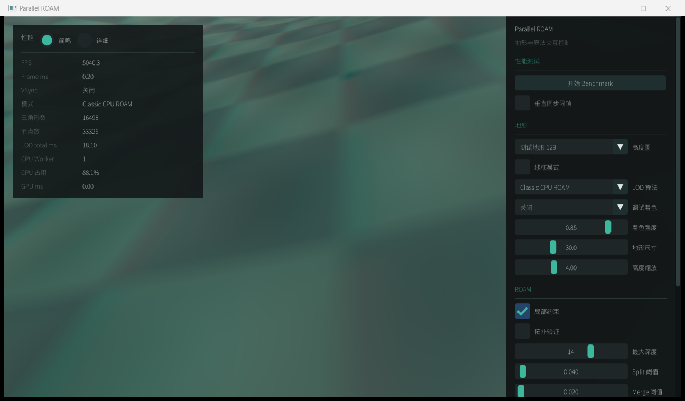

# DX12 迁移阶段 0/1 验收报告

> 日期：2026-07-15  
> 迁移范围：冻结 OpenGL 基线；拆分 SDL 窗口与图形后端生命周期  
> 结论：阶段 0、阶段 1 通过，可以进入阶段 2 的 DX12 最小闭环

## 1. 阶段 0：OpenGL 基线

### 1.1 可回退点

- 基线提交：`d7db6f289c678b2b0c774719afb39539cc942978`
- 基线标签：`pre-dx12-migration-opengl-baseline`
- 构建配置：RelWithDebInfo
- 图形设备：NVIDIA GeForce RTX 5090 D
- OpenGL：4.3.0 NVIDIA 591.86
- 测试高度图：`assets/heightmaps/Hm_Terrain_Test_129.pgm`，129×129
- 参数：地形尺寸 30，高度缩放 4，最大深度 14，split/merge 阈值 0.04/0.02，距离权重 24

### 1.2 基线命令与产物

```powershell
.\build\relwithdebinfo-fetch\bin\ParallelROAM.exe --gpu-smoke-test
.\build\relwithdebinfo-fetch\bin\ParallelROAM.exe --runtime-benchmark
```

- [迁移前截图](../../benchmark-output/migration-baseline-20260715/opengl-window-baseline.png)
- [迁移前运行时报告](../../benchmark-output/runtime-benchmark-20260715-223926.md)
- [迁移前逐帧 CSV](../../benchmark-output/runtime-benchmark-20260715-223926.csv)



### 1.3 基线结果

| 算法 | 平均帧时间 | 平均 LOD 时间 | 平均 GPU 时间 | 最大三角形数 | 最大节点数 | 最大拓扑问题数 |
|---|---:|---:|---:|---:|---:|---:|
| Classic CPU ROAM | 8.88 ms | 8.16 ms | 0.00 ms | 18,786 | 39,630 | 0 |
| 数据导向 CPU ROAM | 5.91 ms | 5.43 ms | 0.00 ms | 18,786 | 39,630 | 0 |
| GPU ROAM-like | 6.29 ms | 5.97 ms | 0.32 ms | 18,786 | 39,630 | 0 |

### 1.4 功能矩阵

| 功能 | 基线状态 |
|---|---|
| SDL2 窗口、输入、相机 | 正常 |
| 高度图和地表纹理 | 正常 |
| Classic CPU ROAM | 正常，拓扑验证问题为 0 |
| 数据导向 CPU ROAM | 正常，8 个工作线程 |
| GPU 活动叶节点压缩、误差评估和候选标记 | 正常 |
| GPU split-only、网格生成和间接绘制 | 正常 |
| ImGui 参数与统计面板 | 正常 |
| 自动烟雾测试和固定路径基准 | 正常 |

### 1.5 已知限制

- GPU ROAM-like 仍以 CPU DOD 拓扑为主，每帧构建并上传快照，不是最终 GPU 常驻拓扑。
- GPU 拓扑更新仅覆盖有限 split-only 情形，完整兼容链、merge 和回收尚未实现。
- 运行时基准按真实帧率采样，同一路径不同运行的样本数和平均拓扑规模会有轻微变化；最大深度、最大节点/三角形数和拓扑正确性更适合作为迁移对等指标。
- CPU 利用率和最大帧时间会受系统调度影响，不能用单次运行判断 API 重构的性能变化。

## 2. 阶段 1：平台与后端边界

### 2.1 已完成改造

- 新增 `IGraphicsBackend`，集中管理窗口属性、图形初始化、清屏、呈现、VSync、drawable 尺寸和 ImGui 后端初始化。
- 新增 `OpenGlGraphicsBackend`，接管原来位于 `Window` 和 `Application` 中的 `SDL_GLContext`、GLAD、清屏和交换缓冲逻辑。
- `Window` 现在只持有 SDL 生命周期和 `SDL_Window`，不再包含 OpenGL 上下文、drawable 尺寸或交换间隔。
- `Application` 只驱动后端生命周期，不再直接包含 OpenGL API 调用。
- ImGui 改用 `ImGuiOpenGlBackendConfig`，为阶段 2 增加独立 DX12 配置保留边界。
- CMake 新增 `PARALLEL_ROAM_GRAPHICS_API=OpenGL|D3D12`；OpenGL 仍构建完整应用，D3D12 在阶段 2 前构建明确的 bootstrap。
- D3D12 配置不再链接 OpenGL、GLAD 或 ImGui OpenGL 后端。
- `TerrainLodRenderPacket` 增加 GPU 资源生命周期和生成编号，并在算法返回与渲染绑定时检查资源契约。

### 2.2 新的生命周期

```text
Window::Initialize
        ↓
IGraphicsBackend::ConfigureWindow
        ↓
Window::Create
        ↓
IGraphicsBackend::Initialize
        ↓
TerrainRenderer::Initialize
        ↓
IGraphicsBackend::InitializeImGui

关闭顺序：ImGui → TerrainRenderer → GraphicsBackend → Window/SDL
```

### 2.3 D3D12 选择验证

配置命令：

```powershell
.\tools\cmake\bin\cmake.exe -S . -B build\stage1-d3d12-bootstrap `
  -DPARALLEL_ROAM_GRAPHICS_API=D3D12 `
  -DPARALLEL_ROAM_FETCH_MISSING_DEPS=ON
.\tools\cmake\bin\cmake.exe --build build\stage1-d3d12-bootstrap --config RelWithDebInfo
```

bootstrap 输出：

```text
Graphics API: D3D12 (backend implementation pending)
OpenGL: not linked
GLAD: not linked
Dear ImGui: not linked
SDL2: initialized timer subsystem
```

这证明后端选择已经进入依赖准备和链接阶段，而不只是一个未使用的 CMake 字符串。

## 3. OpenGL 回归结果

- [阶段 1 后运行时报告](../../benchmark-output/runtime-benchmark-20260715-230725.md)
- [阶段 1 后逐帧 CSV](../../benchmark-output/runtime-benchmark-20260715-230725.csv)

| 算法 | 最大三角形数 | 最大节点数 | 达到最大深度 | 最大拓扑问题数 |
|---|---:|---:|---:|---:|
| Classic CPU ROAM | 18,786 | 39,630 | 14 | 0 |
| 数据导向 CPU ROAM | 18,786 | 39,630 | 14 | 0 |
| GPU ROAM-like | 18,786 | 39,630 | 14 | 0 |

OpenGL GPU 烟雾测试通过；完整 RelWithDebInfo 构建通过；固定路径基准完成。平均帧时间存在正常运行波动，本阶段不据此声称性能改善或退化。迁移对等所需的最大拓扑规模、最大深度和拓扑正确性均保持一致。

## 4. 阶段 1 验收结论

- SDL 窗口生命周期与 OpenGL 上下文生命周期已经分离。
- GPU 初始化、清屏、呈现、VSync 和 drawable 尺寸已下沉到图形后端。
- ImGui 已使用明确的后端配置入口。
- CMake 已具备短期编译期后端选择。
- GPU 渲染包已具有可检查的资源生命周期契约。
- 默认 OpenGL 应用、烟雾测试和基准测试均通过。

阶段 2 可以直接新增 `D3D12GraphicsBackend`，无需再次修改 `Window` 的所有权边界。阶段 2 的首个验收目标仍然是 DX12 清屏、呈现、VSync、窗口缩放和调试层闭环，不应提前迁移地形或 CBT。
