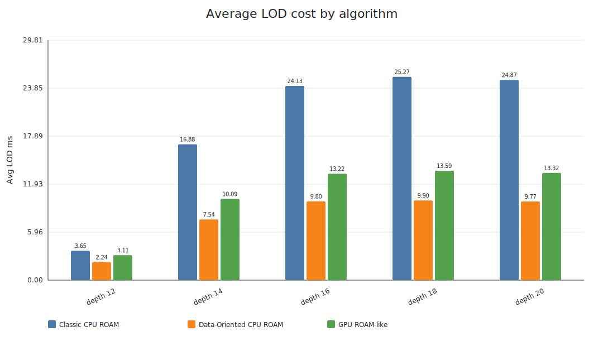
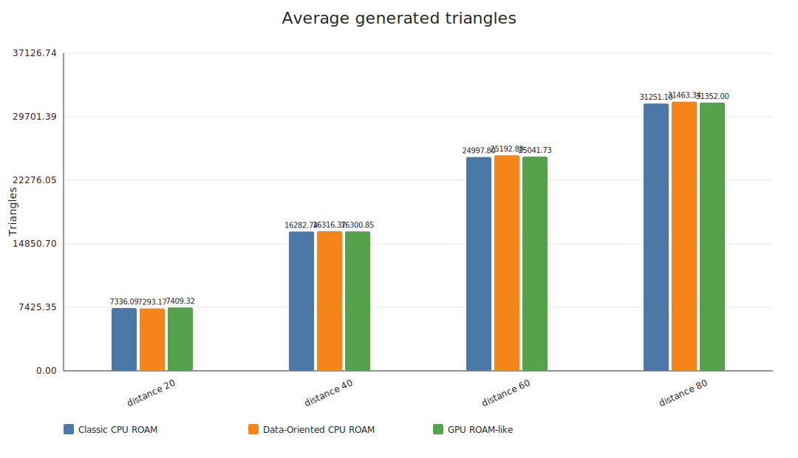
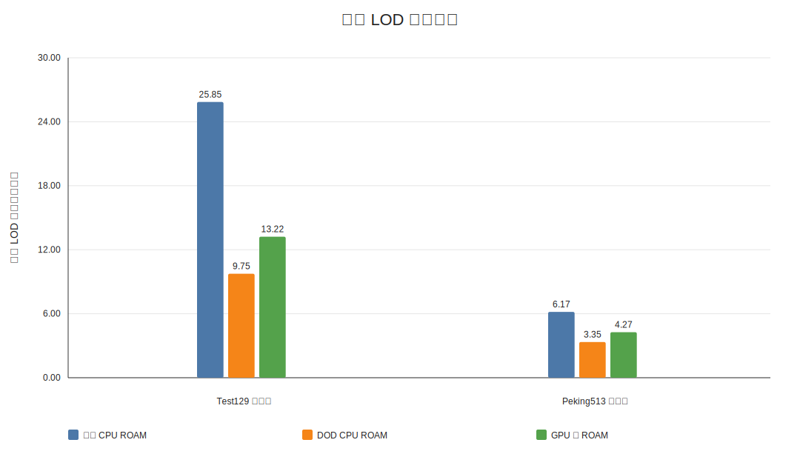
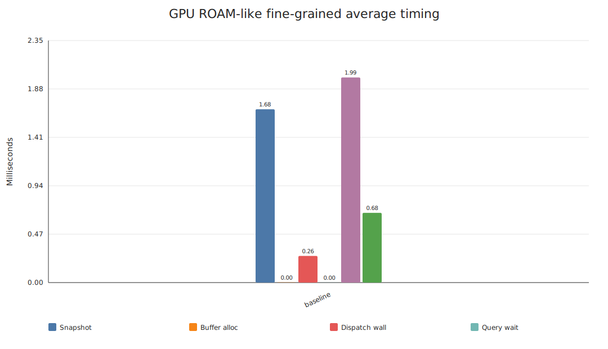

# 基于现代 CPU / GPU 的 ROAM 地形 LOD 算法实现与性能分析报告

## 第一章 绪论

### 1.1 项目背景

我最开始选择这个题目，是因为地形 LOD 这个问题看起来很“经典”，但它其实并没有过时。很多传统地形算法是在单核 CPU 或者早期图形硬件环境下提出的，当时的主要目标是尽量少画三角形、尽量减少 CPU 计算量，让程序能在当时的机器上跑起来。可是现在的硬件环境已经变化很大了：桌面 CPU 已经普遍进入多核心时代，高端 CPU 不只是频率更高，也有更多核心、更复杂的缓存层级；GPU 的发展更明显，现代 GPU 可以用成百上千个执行单元去处理大量结构相似的任务。也就是说，一个算法即使在传统意义上是“优秀算法”，也不代表它天然就能很好地利用现代硬件。

地形 LOD 仍然是现代游戏开发里很重要的性能问题。开放世界游戏越来越常见，玩家也越来越习惯在一个大地图里自由移动。开放世界意味着可见范围大、地形面积大、内容密度高，渲染系统必须在“看起来足够细”和“跑得足够快”之间做平衡。近年的开放世界游戏研究也说明，AAA 开放世界内容规模非常大，有论文对 20 个 AAA 开放世界游戏、约 2200 个任务进行了结构分析，这从另一个角度说明开放世界游戏已经不只是“地图大”，而是地图、任务、探索和内容组织都变得更复杂。这样的趋势会继续放大地形、植被、建筑、阴影和流式加载等系统的压力。

ROAM，也就是实时最优自适应网格（Real-time Optimally Adapting Meshes），是一个很有代表性的连续地形 LOD 算法。它通过二叉三角树不断分裂和合并，让靠近相机或者误差较大的地方保留更多三角形，远处或者平坦区域减少三角形。它的思想很优雅，也很符合“按需细分”的直觉。不过 ROAM 的经典实现里有很多指针、递归、邻接关系和拓扑修补，这些部分在现代 CPU 缓存和 GPU 并行模型下不一定友好。换句话说，ROAM 本身不是问题，问题在于传统写法是否还适合今天的硬件。

与此同时，数据导向设计，也就是 DOD，是现代游戏开发中非常重要的一种工程思想。它和传统面向对象设计不同，不是先从“对象是什么”出发，而是先考虑“数据如何被连续访问、如何被批量处理、如何减少缓存未命中”。在游戏引擎里，ECS 和 SoA 数据布局都和这种思想关系很深。它的目标不是让代码看起来更像现实世界，而是让 CPU 更舒服地读取数据、让多线程更容易分工。

GPU 编程则是另一个方向。OpenGL 4.3 开始正式把计算着色器和着色器存储缓冲区对象等能力放到图形 API 里，这让开发者可以不通过传统顶点/片元管线，也能把通用计算任务放到 GPU 上执行。对于重复性强、数据量大、分支相对可控的任务，计算着色器很适合。ROAM 中的误差计算、候选标记、活跃叶节点扫描和网格输出都看起来有一定并行潜力，所以我也想试试看，把 ROAM 中适合并行的阶段迁移到 GPU 后，实际系统性能会不会真的变好。

### 1.2 选题意义

本项目不是想证明“ROAM 已经过时”，也不是想声称我完全发明了一个新的地形 LOD 算法。我的目标更具体：我想把经典 CPU ROAM、数据导向 CPU ROAM 和 GPU 类 ROAM 三个版本放在同一个工程、同一套参数、同一条相机路径下进行对比，观察 ROAM 这个传统算法在现代硬件上的不同表现。

我比较关心的问题有三个。第一个问题是，经典 ROAM 的传统语义到底能不能稳定实现，它作为基准版本是否足够可靠。第二个问题是，如果把基于指针的节点改成基于索引的节点池，并把活跃叶节点扫描、误差评估、候选标记和网格输出等阶段改成更适合 CPU 缓存与多线程的方式，DOD 版本到底能获得多少收益。第三个问题是，GPU 真的能让 ROAM 变快吗，还是说 GPU 计算本身很快，但 CPU-GPU 数据交界会抵消收益。

这个对比的意义在于，它不是只看“最终帧率谁高”，而是拆开看算法不同阶段的代价。比如 ROAM 的误差评估可以并行，网格输出也可以并行，但分裂 / 合并的拓扑约束和无裂缝邻接修复就不一定适合无脑并行。通过这样的实验，我希望报告最后能给出一个比较朴素但有用的结论：传统地形 LOD 算法不是简单地“搬到 GPU 就会更快”，而是要看算法的哪些阶段真的适合现代硬件。

### 1.3 国内外研究现状

ROAM 的原始论文《ROAMing Terrain: Real-time Optimally Adapting Meshes》发表于 1997 年。它提出的核心思想是把规则网格地形组织成二叉三角树，用优先队列驱动分裂和合并，并通过菱形结构维护相邻三角形之间的连续性。这个算法在当时非常有意义，因为它能用相对少的三角形表达复杂地形，并且能根据视点变化动态调整网格。

后来地形 LOD 继续发展，出现了分块 LOD、几何 Clipmap、CDLOD、基于 Clipmap 的地形渲染等方案。和 ROAM 相比，这些方法往往更偏向块级处理或者规则结构，牺牲一部分局部最优细分能力，换取更好的批处理、更稳定的 GPU 渲染和更简单的数据流。也正因为如此，ROAM 在现代实时游戏引擎里不是最流行的地形方案，但它作为研究对象仍然很有价值，因为它把“误差驱动细分”和“拓扑连续性维护”这两个问题展示得很清楚。

DOD 和 ECS 的相关研究主要关注数据布局、并行执行和缓存友好性。近年的 ECS 研究会讨论任务调度、并发执行和组件数据访问方式，这和我项目中的 DOD ROAM 思路是相通的。我的 DOD 版本并不是完整 ECS，但它吸收了类似思想：节点不再主要靠对象指针互相连接，而是放在基于索引的节点池中；一些阶段不再一个节点一个节点地递归处理，而是把活跃叶节点、候选项和输出网格当作批量数据来处理。

GPU 方向上，计算着色器给图形程序提供了更灵活的计算入口。Khronos 在 OpenGL 4.3 发布说明中明确把计算着色器和着色器存储缓冲区对象作为重要增强能力，这正好对应本项目 GPU 版本中使用的 SSBO、计数缓冲区、计时查询和间接绘制。GPU 的优势是大规模并行吞吐，但限制是 CPU-GPU 同步、数据上传、读回等待和拓扑写冲突。我的 GPU 类 ROAM 版本也正是在这些限制中不断调整出来的：它证明了一些阶段能迁移到 GPU，但也暴露了完整 ROAM 拓扑并不容易完全 GPU 化。

### 1.4 主要功能概述

本项目最终实现的是一个可以实时运行的 C++ OpenGL 地形渲染程序。我基于 SDL2 创建窗口和 OpenGL 上下文，用 GLM 处理相机和矩阵，用 Dear ImGui 做运行时参数面板，用 OpenGL 完成地形网格绘制。程序支持高度图地形加载、贴图采样、基础光照、线框显示、LOD 调试着色显示，也可以在运行时切换经典、DOD 和 GPU 三种算法。

算法方面，我实现了经典 CPU ROAM、数据导向 CPU ROAM 和 GPU 类 ROAM 三个版本。经典版本保留传统二叉三角树、分裂 / 合并、基边邻居、菱形强制分裂和拓扑验证。DOD 版本把节点池改成基于索引的结构，并对误差评估、候选收集、部分拓扑提交和网格输出做多线程优化。GPU 版本在 DOD CPU 拓扑基准的基础上，加入 GPU 活跃叶节点压缩、误差评估、候选标记、仅分裂实验、GPU 网格输出和间接绘制。

为了让性能分析更可靠，我还实现了运行时基准测试。这个测试会让相机沿固定路径移动，按经典、DOD、GPU 的顺序运行同一组参数，并自动输出 Markdown 和 CSV。输出指标包括帧耗时、LOD 耗时、CPU 更新耗时、CPU 上传耗时、GPU 计算耗时、GPU 快照构建耗时、缓冲区分配耗时、调度墙钟耗时、查询等待、读回等待、三角形数、节点数、CPU 工作线程数和 CPU 利用率。后面的第四章就是基于这些数据进行分析。

## 第二章 相关技术与理论基础

### 2.1 ROAM 的核心原理

ROAM 的输入可以看作一张 高度图。假设高度图定义为函数 \(H(u,v)\)，其中 \(u,v\) 是地形平面上的坐标，高度值是 \(H\)。渲染时我把它映射到三维空间：

\[
P(u,v) = (x, y, z) = (u \cdot S, H(u,v) \cdot A, v \cdot S)
\]

这里 \(S\) 表示地形尺寸缩放，\(A\) 表示高度缩放。ROAM 并不是一开始就把高度图的所有网格都画出来，而是先用两个大三角形覆盖整个地形，然后根据误差不断细分三角形。每次分裂时，一个三角形沿基边的中点裂成两个子三角形。不断分裂后，整张地形就变成一棵或两棵二叉三角树。

误差估计是 ROAM 的核心。对于一个三角形 \(T=(p_0,p_1,p_2)\)，可以取基边的中点 \(m\)，用三角形两个端点的线性插值高度估计 \(\hat{H}(m)\)，再和真实高度图高度 \(H(m)\) 比较：

\[
e_h = |H(m) - \hat{H}(m)|
\]

如果只用这个高度误差，问题是平坦区域即使离相机很近也可能不细分，所以我在实现中还加入了屏幕空间和距离因素。可以把一个简化后的 分数 写成：

\[
e_s = \frac{e_h \cdot w_h + l_p \cdot w_l}{\max(d, \epsilon)}
\]

其中 \(d\) 是三角形中心到相机的距离，\(l_p\) 是三角形边长或投影边长相关项，\(w_h\) 和 \(w_l\) 是权重。这个公式不是为了追求严格物理含义，而是为了让近处区域有更强的细分压力，避免相机贴近地面时仍然看到很粗的网格。

ROAM 还需要解决裂缝问题。假设一个三角形分裂了，但它基边对面的邻居没有分裂，那么这条共享边的一侧会有两个小边，另一侧仍然是一条大边，中间就可能出现 T 形裂缝。ROAM 通过基边邻居和菱形关系处理这个问题。简单说，如果一个叶节点要分裂，而它的基边邻居还没有处在合法菱形状态，就要先强制分裂对方，让两侧一起进入可兼容的拓扑状态。这个过程让算法不仅是“误差驱动”，也必须是“拓扑约束驱动”。

合并则和分裂相反。为了避免地形在阈值附近来回抖动，我使用迟滞控制，也就是分裂阈值和合并阈值分开设置。当前实验默认分裂阈值是 0.04，合并阈值是 0.02。这样只有误差足够大时才分裂，而误差降到更低时才合并，画面稳定性会更好。

### 2.2 数据导向设计的优化思路

经典 ROAM 的实现方式很自然：每个节点是一个对象，里面有左子节点、右子节点、基边邻居、左邻居、右邻居等指针。这样写起来直观，但它对现代 CPU 不一定友好。CPU 访问一个节点后，下一步可能跳到内存中很远的另一个节点，缓存命中率会下降。多线程处理时，如果每个线程都在追踪复杂指针关系，也容易出现锁、冲突和不稳定的访问模式。

DOD 的想法是把“对象关系”改成“数据流”。在我的 DOD ROAM 中，节点放在连续的节点池里，节点之间主要用索引引用。这样节点数据更容易连续扫描，也更容易按范围切给工作线程。比如活跃叶节点收集可以扫描一段节点索引，候选标记可以把活跃叶节点分成多个分块，网格输出可以预先确定输出大小后让不同工作线程写入不同三角形槽位。

从理论上说，DOD 的收益主要来自两个方面。第一是缓存友好性。连续数组比零散对象更容易被 CPU 缓存和预取机制利用。第二是并行粒度。很多阶段可以写成：

\[
for\ i \in [begin, end):\quad process(节点_i)
\]

然后把 \([begin,end)\) 切成多个区间交给不同线程。只要每个线程写自己的局部缓冲区，最后再统一合并，就可以减少锁竞争。

但是 ROAM 不是所有阶段都适合直接并行。误差评估和候选标记相对容易，因为它们主要是读节点状态、写局部候选。网格输出也比较容易，因为每个叶节点输出一个三角形，可以预分配输出槽位。真正麻烦的是拓扑提交，也就是分裂、合并和邻接关系重连。这里会改节点父子关系、邻接关系和菱形状态，如果多个工作线程同时改相邻区域，很容易破坏拓扑一致性。因此我的 DOD 版本没有把所有提交都强行并行，而是把比较安全的内部分块候选项并行处理，把边界和可能冲突的部分保留串行回退。这个取舍是项目里一个很重要的工程判断：性能优化不能以破坏地形连续性为代价。

### 2.3 计算着色器与 GPU 迁移原理

GPU 适合处理大量相似任务。计算着色器的执行模型通常是把任务分成很多工作组，每个调用实例处理一个或几个元素。OpenGL 4.3 提供了计算着色器和 SSBO，使我可以把节点缓冲区、活跃叶节点缓冲区、候选缓冲区、计数缓冲区、顶点缓冲区和索引缓冲区放到 GPU 侧，让着色器直接读写。

在我的 GPU 类 ROAM 中，GPU 阶段大致可以写成这种形式：

\[
全局\_id = gl\_GlobalInvocationID.x
\]

如果全局调用编号小于活跃叶节点数量，就处理对应的叶节点。活跃叶节点压缩会把有效叶节点写入连续缓冲区，误差评估会计算屏幕误差，候选标记会标记分裂和合并候选，网格输出会把活跃叶节点转成顶点和索引。这个流程适合 GPU 的地方在于，每个叶节点的计算逻辑比较相似，很多时候只需要读高度图、读节点缓冲区，再写一个结果。

不过 GPU 版本最大的问题不是着色器算不动，而是数据怎么来、结果什么时候读回、CPU 和 GPU 什么时候同步。如果每帧都把 CPU DOD 拓扑打包成完整快照再上传，再立刻读取计时查询和计数缓冲区，那么 CPU 会被 GPU 同步拖住。也就是说，即使 GPU 计算只有 0.6ms，完整 LOD 管线也可能比 DOD CPU 慢。这个问题在第四章的实验 5 中表现得很明显。

因此我后期对 GPU 路径做了几个优化。高度图纹理只在加载或切换高度图时上传，不再每帧 `glTexImage2D`。SSBO、VBO、IBO 和间接绘制缓冲区都保留容量，容量够时只用 `glBufferSubData` 更新必要范围。计时查询和计数器读回也改成四槽环形缓冲区，延迟几帧读取，尽量避免每帧 `GL_QUERY_RESULT` 造成阻塞。这些优化没有让 GPU 版本立刻超过 DOD，但让瓶颈更清楚地暴露出来：现在慢的重点已经不是着色器计算，而是 CPU-GPU 数据交界和当前仍保留的 CPU 拓扑基准版本。
再修一下技术与理论基础的部分，再具体一点，不要写自己后期做了什么优化和修改，就纯粹地介绍技术和理论，多加数学公式和具体推导。还有其他你觉得可以优化的地方也优化一下

## 第三章 系统设计与实现

### 3.1 项目概览

本项目使用 C++20 编写，使用 Git 做版本控制，使用 CMake 管理构建。窗口和输入层使用 SDL2，数学计算和相机矩阵使用 GLM，调试界面使用 Dear ImGui，渲染核心使用 OpenGL。项目支持 Debug、Release 和 RelWithDebInfo 构建，其中正式基准测试使用 RelWithDebInfo，因为它既保留了一定调试信息，也更接近实际性能表现。

截至本报告撰写时，项目 Git 提交数为 48。按不包含 `tools`、`third_party` 和 `build` 的自写工程口径统计，项目文件约 141 个，其中 `src` 下 C++ 源码与头文件 75 个，核心源码约 14413 行。去掉空行后，代码行约 11157 行，注释行约 1405 行，注释覆盖率约 11.18%。这些数据不是为了证明代码很多，而是为了说明这个项目不是只写了一个单文件演示程序，而是把窗口、渲染、地形加载、算法、GPU 阶段、基准测试和文档都拆成了独立模块。

图3-1 是项目总体架构图。它从上到下展示了应用主循环如何协调 SDL2、输入相机、Dear ImGui、地形渲染器、高度图、三种 LOD 算法和运行时基准测试。


### 3.2 三种算法子架构

经典 CPU ROAM 的子架构如图3-2 所示。这个版本最接近传统 ROAM 语义，核心是持久化二叉三角树、分裂优先队列、合并菱形队列、强制分裂和拓扑验证。我把它作为正确性基准版本，因为后面的 DOD 和 GPU 都需要知道自己有没有偏离 ROAM 的基本语义。


DOD ROAM 的子架构如图3-3 所示。这个版本把节点组织成基于索引的节点池，尽量把可批处理阶段改成并行阶段。误差评估、活跃叶节点收集、候选标记和网格输出都可以比较自然地并行；拓扑提交则采用保守策略，能安全分块的内部候选项并行处理，不能保证安全的部分回到串行路径。


GPU 类 ROAM 的子架构如图3-4 所示。这个版本目前仍然保留 DOD CPU 拓扑基准版本，然后把活跃叶节点压缩、误差评估、候选标记、仅分裂实验和网格输出放到 GPU 上。这样做不是最终理想形态，但它让我能一步一步验证 ROAM 哪些阶段适合 GPU，哪些阶段仍然卡在拓扑同步和数据交界上。


### 3.3 模块划分

项目入口只负责解析命令行参数，比如普通运行、冒烟测试、GPU 冒烟测试、运行时基准测试和基准测试参数覆盖。真正的主循环由 `Application` 类承担，它持有窗口、输入、相机、渲染器、界面层和基准测试状态机。这样入口文件不会堆太多逻辑，主循环也能集中处理“每一帧先读输入、再更新相机、再更新地形、再画界面、最后交换缓冲区”的流程。

窗口模块负责 SDL2 窗口、OpenGL 上下文、垂直同步设置和窗口尺寸刷新。输入模块维护键盘、鼠标和窗口事件状态，相机控制模块根据输入更新观察位置和朝向。渲染模块的核心类是 `TerrainRenderer`，它统一接收界面设置和算法输出，并负责网格上传、着色器统一变量、绘制调用和统计数据。地形加载模块由 `HeightMap` 类承担，支持 PGM 和 PNG 资源。

算法模块都实现同一个抽象接口 `ITerrainLodAlgorithm`。这样地形渲染器不需要知道内部到底是经典版本、DOD 版本还是 GPU 版本，只要传入高度图、相机位置和 LOD 参数，就能得到统一的渲染数据包。经典算法的核心类是 `ClassicRoamMeshBuilder`，DOD 算法的核心类是 `DataOrientedRoamMeshBuilder`，GPU 算法的核心类是 `GpuRoamTerrainLodAlgorithm` 和 `GpuRoamMeshBuilder`。我觉得这个统一接口很重要，因为它让三种算法能在同一个基准测试里公平对比，而不是每种算法写一套单独测试逻辑。

基准测试模块分为两类。第一类是无窗口算法层基准测试，适合做冒烟测试和基础回归；第二类是真实应用内运行时基准测试，它会在 OpenGL 上下文存在的情况下运行，所以能测到 GPU、网格上传、帧耗时和界面参数。第四章的数据主要来自运行时基准测试。

### 3.4 关键代码片段解析

这一节不按源码文件顺序介绍，而是按项目里最核心的执行逻辑来讲。我把代码解析分成四块：经典 CPU ROAM、数据导向 CPU ROAM、GPU 类 ROAM，以及它们共同依赖的支撑代码。三种算法各自对应一个核心模块，支撑代码则负责统一输入输出、渲染分流和基准测试采样。

下面的代码不是完整源码的机械粘贴，而是从项目真实类和函数中整理出的关键逻辑。我删去了部分日志、错误字符串和界面细节，但保留判断条件、状态更新和数据流转，并在代码里补了注释。这样写的目的不是展示“写了哪些函数”，而是解释一帧中数据怎样一步一步经过算法，最后变成可以绘制和统计的结果。

#### 3.4.1 经典 CPU ROAM：用二叉三角树维护无裂缝拓扑

经典版本的核心类是 `ClassicRoamMeshBuilder`，属于经典 ROAM 算法模块。它内部保存两棵根三角树，两个根三角形共同覆盖整张高度图。每一帧更新时，算法不是把树全部删掉再重新生成，而是在已有拓扑上先尝试合并远处低误差节点，再把当前视角下误差较高的叶节点继续分裂。这样做更接近传统 ROAM 的跨帧维护语义，也能让迟滞控制和合并逻辑真正发挥作用。

先看它的一帧入口。这里的关键不是某一个数学公式，而是顺序：先判断是否需要重置拓扑，再合并，再分裂，最后在拓扑稳定后收集叶节点并输出网格。如果顺序反过来，比如先输出网格再合并，统计和画面就会对应不上。

```cpp
TerrainMeshData ClassicRoamMeshBuilder::Build(
    const HeightMap& heightMap,
    float terrainSize,
    float heightScale,
    const glm::vec3& cameraPosition,
    const ClassicRoamSettings& settings)
{
    // 记录本帧输入。相机位置只影响屏幕误差，不一定要求清空整棵树。
    _heightMap = &heightMap;
    _cameraPosition = cameraPosition;
    _terrainSize = terrainSize;
    _heightScale = heightScale;
    _settings = settings;

    // 如果高度图、缩放或最大深度不再兼容，旧拓扑里的误差缓存就不能复用。
    if (NeedsTopologyReset(heightMap, terrainSize, heightScale, settings))
    {
        ResetTopology();
    }

    // 先回收远处低误差细节，避免旧细节一直残留在地形远处。
    MergeWithDiamondQueue();

    // 再根据当前相机位置，把误差大的叶节点继续向下分裂。
    RefineWithSplitQueue(_rootA, _rootB);

    // 验证只负责统计问题，不在这里偷偷修拓扑，避免掩盖算法错误。
    if (_settings.EnableTopologyValidation)
    {
        ValidateTopology();
    }

    // 拓扑稳定后再收集叶节点；这些叶节点就是本帧真正要画的三角形。
    CollectLeafNodes(_activeLeaves);
    EmitLeafTriangles(meshData, _activeLeaves);
    AccumulateLeafStats(meshData, _activeLeaves);
    return meshData;
}
```

这段入口逻辑对应了经典 ROAM 的完整生命周期。`NeedsTopologyReset` 只在输入资源或拓扑上限变化时清空树，相机普通移动不会重置，这是为了保留跨帧节点身份。`MergeWithDiamondQueue` 放在前面，是因为上一帧近处的细节在这一帧可能已经变成远处，如果不先合并，后面的分裂只会不断增加节点，拓扑规模会越来越大。`RefineWithSplitQueue` 再接着运行，把新的细节补到当前相机真正需要的位置。最后统一收集叶节点，是为了保证网格输出、统计面板和基准测试看到的是同一份最终拓扑。

下面这段代码展示的是分裂阶段的核心流程。它没有直接递归“看见一个能分裂就分裂”，而是先把所有活跃叶节点按屏幕误差放进优先队列。这样误差最大的三角形会先处理，细节更集中在相机附近或地形变化更明显的位置。

```cpp
void ClassicRoamMeshBuilder::RefineWithSplitQueue(Node* rootA, Node* rootB)
{
    priority_queue<SplitCandidate> candidates;

    auto enqueueCandidate = [&](Node* node) {
        // 只有叶节点才代表当前可见网格中的一个三角形
        if (node == nullptr || !IsLeaf(node) || node->Depth >= _settings.MaxDepth)
            return;

        // 屏幕误差越大，越应该优先分裂
        float score = ComputeScreenErrorScore(*node);
        if (score >= _settings.SplitThreshold)
            candidates.push({score, _sequence++, node});
    };

    auto enqueueActiveLeaves = [&](auto&& self, Node* node) -> void {
        if (node == nullptr)
            return;

        if (IsLeaf(node))
        {
            enqueueCandidate(node);
            return;
        }

        // 根节点可能早已分裂，所以必须深入到当前活跃叶节点
        self(self, node->LeftChild);
        self(self, node->RightChild);
    };

    enqueueActiveLeaves(enqueueActiveLeaves, rootA);
    enqueueActiveLeaves(enqueueActiveLeaves, rootB);

    while (!candidates.empty())
    {
        SplitCandidate c = candidates.top();
        candidates.pop();

        // 候选可能已被强制分裂消耗，弹出时要重新检查
        if (!IsLeaf(c.Node))
            continue;

        // 分裂会修改拓扑，因此弹出时重新计算一次误差
        if (ComputeScreenErrorScore(*c.Node) < _settings.SplitThreshold)
            continue;

        Node* oldBaseNeighbor = c.Node->BaseNeighbor;
        if (!SplitNode(c.Node, SplitReason::Requested, nullptr))
            continue;

        // 当前节点分裂后，新产生的两个子节点也可能继续满足细分条件
        enqueueCandidate(c.Node->LeftChild);
        enqueueCandidate(c.Node->RightChild);

        // 基边邻居可能因为裂缝修复被同步分裂，也要把它的子节点重新放回队列
        if (oldBaseNeighbor != nullptr && !IsLeaf(oldBaseNeighbor))
        {
            enqueueCandidate(oldBaseNeighbor->LeftChild);
            enqueueCandidate(oldBaseNeighbor->RightChild);
        }
    }
}
```

这段代码可以分成三步理解。第一步是收集候选。因为经典 ROAM 的拓扑是持久化的，根节点在第一帧之后通常已经不是叶节点，所以算法不能只把两个根节点放进队列，而是要递归找到当前真正参与渲染的叶节点。每个叶节点代表当前网格中的一个三角形，只有它才需要重新计算屏幕误差。

第二步是优先队列驱动分裂。队列按照屏幕误差排序，误差越大的三角形越先被处理。这里弹出候选后还要重新检查一次，是因为 ROAM 的强制分裂会改变局部拓扑，某个候选可能在等待队列期间已经被邻居关系牵连处理掉。这个重新检查虽然多花一点计算，但能避免使用过期候选破坏拓扑。

第三步是分裂后的重新入队。一个节点分裂后会产生两个子节点，它们可能仍然离相机很近，需要继续分裂。与此同时，基边邻居也可能因为裂缝修复被同步分裂，所以它的新子节点也要重新进入候选队列。这样算法才能在一个更新过程中连续向更细层级推进，而不是每帧只分裂一小步。

真正保证无裂缝的是 `SplitNode`。它不是简单创建两个子三角形，而是先检查基边邻居是否处于兼容状态。如果对面的邻居还没有分裂，就先递归强制分裂邻居，让共享边两侧进入同一个菱形结构。

```cpp
bool ClassicRoamMeshBuilder::SplitNode(Node* node, SplitReason reason, Node* forcedFrom)
{
    if (!IsLeaf(node) || node->Depth >= _settings.MaxDepth)
        return false;

    Node* baseNeighbor = node->BaseNeighbor;

    if (_settings.EnableLocalConstraints && baseNeighbor != nullptr)
    {
        // 如果基边邻居还没有形成可兼容菱形，就先分裂邻居
        if (IsLeaf(baseNeighbor) && baseNeighbor != forcedFrom)
        {
            SplitNode(baseNeighbor, SplitReason::ForcedByBaseNeighbor, node);
        }

        // 邻居分裂后，当前节点的邻接指针可能已被重连，需要刷新
        baseNeighbor = node->BaseNeighbor;
    }

    // 首次分裂时创建子节点；合并后再次分裂时可以复用子节点对象
    if (node->LeftChild == nullptr || node->RightChild == nullptr)
    {
        TriangleDomain leftDomain;
        TriangleDomain rightDomain;
        SplitTriangleByBaseEdge(node->Domain, leftDomain, rightDomain);
        node->LeftChild = AddNode(leftDomain, node, node->Depth + 1);
        node->RightChild = AddNode(rightDomain, node, node->Depth + 1);
    }

    node->IsSplit = true;

    // 分裂后重新连接当前节点、子节点和基边邻居之间的邻接关系
    LinkSplitNeighbors(node, baseNeighbor);
    return true;
}
```

这段逻辑体现了经典 ROAM 最核心的地方：误差分数只决定“想不想分裂”，拓扑约束决定“能不能直接分裂”。如果当前三角形沿基边分裂，而基边邻居还是粗三角形，那么共享边两侧就会出现一边两条小边、一边一条大边的情况，也就是 T 形裂缝。因此我在分裂前先处理基边邻居，再创建子节点并重连邻接关系。`forcedFrom` 的作用是避免两个互为基边邻居的节点在强制分裂时来回递归。

经典版本最后还会做可选拓扑验证。拓扑验证不主动修复网格，而是把裂缝风险和邻接错误转成统计值，用来判断“画面看起来没问题”是否真的成立。

```cpp
for (LeafTriangle leaf : activeLeaves)
{
    // 检查粗边中间是否贴着其他叶节点端点，这是典型 T 形裂缝风险
    if (DetectTJunction(leaf, allLeafEdges))
        ++_stats.TjunctionCount;

    // 检查当前节点记录的邻居是否真的共享同一条边
    if (!ValidateNeighborLink(leaf.BaseNeighbor, leaf.BaseEdge))
        ++_stats.InvalidNeighborCount;
}
```

这部分之所以放进关键实现，是因为它保证经典版本能作为后面两个版本的正确性参照。如果经典版本只输出三角形数量，却不检查 T 形裂缝、非法邻居和非法拓扑，那么 DOD 或 GPU 版本即使跑得更快，也不知道是否还保留了 ROAM 的基本语义。

#### 3.4.2 数据导向 CPU ROAM：把节点关系改成可批处理的数据流

DOD 版本的核心类是 `DataOrientedRoamMeshBuilder`，属于数据导向 ROAM 算法模块。它仍然做 ROAM 的分裂、合并和裂缝约束，但内部不再主要依赖对象指针，而是把节点放进基于索引的节点池。节点的父子、邻居、深度、标记和误差分数都可以按数组连续访问。这个改动是后面并行扫描、候选标记、拓扑分块和 GPU 快照构建的基础。

```cpp
struct DataOrientedRoamNodePool
{
    // 每个数组的下标都是 nodeIndex，同一个下标描述同一个 ROAM 节点。
    // 这样遍历节点时可以连续读取某一类字段，而不是沿指针跳转。
    std::vector<TriangleDomain> Domains;
    std::vector<DataOrientedRoamNodeIndex> Parents;
    std::vector<DataOrientedRoamNodeIndex> LeftChildren;
    std::vector<DataOrientedRoamNodeIndex> RightChildren;
    std::vector<DataOrientedRoamNodeIndex> BaseNeighbors;
    std::vector<DataOrientedRoamNodeIndex> LeftNeighbors;
    std::vector<DataOrientedRoamNodeIndex> RightNeighbors;
    std::vector<DataOrientedRoamChunkId> InteriorChunkIds;
    std::vector<float> GeometricErrors;
    std::vector<float> ScreenErrors;
    std::vector<int> Depths;
    std::vector<std::uint8_t> IsSplits;
};
```

这段结构的重点不是“把指针换成整数”这么简单，而是把访问方式从“顺着对象跳来跳去”改成“按下标批量扫描”。例如收集活跃叶节点时，算法主要看 `IsSplits` 和 `Depths`；输出网格时，只需要用叶节点索引访问 `Domains`；构造 GPU 快照时，也可以把这些连续数组编码成缓冲区记录。它牺牲了一部分对象写法的直观性，但换来了更稳定的内存访问和更清楚的并行任务边界。

每帧更新时，DOD 版本先整理状态，再执行合并、分裂、验证、叶节点收集和网格输出。它和经典版本的算法顺序相似，但每个阶段尽量使用节点索引和批量数组。

```cpp
TerrainMeshData DataOrientedRoamMeshBuilder::BuildInternal(
    const HeightMap& heightMap,
    const glm::vec3& cameraPosition,
    bool emitCpuMesh)
{
    // state 是整个 DOD 模块的工作集，本帧所有阶段都通过它传递数据。
    ++state.BuildSequence;
    state.CameraPosition = cameraPosition;
    state.Stats = {};
    state.FinalActiveLeaves.clear();

    if (NeedsTopologyReset(state, heightMap, settings))
        ResetTopology(state);

    // 先合并低误差区域，避免旧细节一直留在远处
    MergeWithDiamondQueue(state);

    // 再按当前相机位置补充分裂，把细节分配到近处和高误差区域
    RefineWithSplitQueue(state);

    if (settings.EnableTopologyValidation)
        ValidateTopology(state);

    // 拓扑稳定后收集叶节点，后续统计、CPU 输出和 GPU 快照都复用它。
    CollectLeafNodes(state, state.FinalActiveLeaves);

    if (emitCpuMesh)
        EmitLeafTriangles(state, meshData, state.FinalActiveLeaves);

    AccumulateLeafStats(state, state.FinalActiveLeaves);
    return meshData;
}
```

这段代码和经典版本的入口很像，但内部数据流已经变了。经典版本的很多操作是“拿到一个节点指针，再沿邻居指针走”；DOD 版本则是“拿到节点下标，再到节点池的不同数组中取字段”。`emitCpuMesh` 这个参数也很关键：普通 DOD 算法会输出 CPU 网格，而 GPU 类 ROAM 只需要 DOD 维护拓扑，不需要它再生成一份 CPU 网格，所以可以跳过网格输出。这样 GPU 路径不会白白做一次 CPU 网格构建。

这段入口里有两个容易被忽略的顺序。第一，合并在分裂之前执行。这样远处或者低误差区域的旧细节会先被回收，然后分裂阶段再根据当前相机位置补回需要的细节。第二，叶节点快照一定要在拓扑稳定之后收集。因为网格输出、统计数据和 GPU 快照都依赖这份叶节点列表，如果边输出边改拓扑，很容易出现三角形数量和实际节点状态对不上的情况。

DOD 中最容易并行的是候选收集和误差评估。每个活跃叶节点的屏幕误差基本只依赖自身定义域、高度图和相机位置，不需要写邻居关系，所以我把活跃叶节点切成多个连续区间，让每个工作线程处理一段。

```cpp
void CollectSplitCandidates(State& state, vector<SplitCandidate>& outCandidates)
{
    // 每个工作线程一个局部候选数组，减少共享写入。
    vector<vector<SplitCandidate>> localCandidates(workerCount);

    RunWorkers(workerCount, [&](size_t workerIndex) {
        size_t begin = workerIndex * chunkSize;
        size_t end = min(begin + chunkSize, state.ActiveLeaves.size());

        for (size_t i = begin; i < end; ++i)
        {
            NodeIndex node = state.ActiveLeaves[i];
            float score = EvaluateScreenErrorForNode(state, node);

            // 每个叶节点只读自身定义域、误差缓存和相机位置，适合并行评分。
            if (ShouldSplitWithScore(state, node, score))
                localCandidates[workerIndex].push_back({score, i, node});
        }
    });

    // 主线程统一合并局部候选，并重新分配稳定顺序号。
    for (auto& local : localCandidates)
    {
        outCandidates.insert(outCandidates.end(), local.begin(), local.end());
    }
}
```

这里的逻辑关键是“局部写、最后合并”。如果所有工作线程都往同一个候选数组里追加元素，就必须加锁，候选越多锁竞争越明显，最后可能把并行收益抵消掉。我采用每个工作线程一个局部候选数组，扫描结束后再由主线程合并。这样每个工作线程只读共享状态、写自己的局部内存，数据竞争比较少，也更符合 DOD 的批处理思路。

真正麻烦的是拓扑提交。分裂和合并会修改父子关系、基边邻居、左邻居和右邻居，如果两个线程同时修改相邻三角形，就可能破坏无裂缝约束。因此 DOD 版本没有把所有候选都强行并行，而是先把候选按地形区域分块，只让完全落在安全内部分块里的候选并行提交，剩下的边界候选回到串行队列处理。

```cpp
void RefineWithSplitQueue(State& state)
{
    vector<SplitCandidate> initialCandidates;
    CollectSplitCandidates(state, initialCandidates);

    // 先找出互不相邻、比较安全的内部分块候选
    auto interiorChunks = BuildInteriorSplitChunks(state, initialCandidates);
    vector<CommittedSplit> committed = CommitInteriorSplitChunks(state, interiorChunks);

    priority_queue<SplitCandidate> queue;

    // 没有被并行批次消耗的候选，进入串行优先队列继续处理
    for (SplitCandidate c : initialCandidates)
    {
        if (state.IsValidNode(c.Node) && state.IsLeaf(c.Node))
            queue.push(c);
    }

    // 并行提交产生的新子节点，也要重新进入串行队列继续细分
    for (CommittedSplit s : committed)
    {
        EnqueueIfStillSplittable(queue, state.Nodes[s.Node].LeftChild);
        EnqueueIfStillSplittable(queue, state.Nodes[s.Node].RightChild);
    }

    // 串行收尾负责处理边界、过期候选和强制分裂传播
    while (!queue.empty())
    {
        SplitCandidate c = queue.top();
        queue.pop();

        if (!state.IsLeaf(c.Node))
            continue;

        if (SplitNode(state, c.Node, Requested))
        {
            EnqueueIfStillSplittable(queue, state.Nodes[c.Node].LeftChild);
            EnqueueIfStillSplittable(queue, state.Nodes[c.Node].RightChild);
        }
    }
}
```

这一段是 DOD 版本里最重要的工程取舍。纯粹从性能角度看，把所有分裂都并行提交最诱人，但 ROAM 的拓扑约束决定了相邻候选之间可能互相影响。我的做法是让“内部安全区域”先并行，尽量利用多核；再用串行队列做最终一致性收尾，处理边界候选、过期候选和强制分裂传播。这样它不是最激进的并行算法，但能在保持拓扑正确的前提下明显降低 CPU 更新时间。

最后是网格输出。DOD 版本在拓扑稳定后已经有一份活跃叶节点快照，每个叶节点最终都会输出一个三角形。只要提前确定输出数组大小，不同工作线程就可以写不同的三角形区间。

```cpp
void EmitLeafTriangles(State& state, MeshData& mesh, span<NodeIndex> leaves)
{
    mesh.Vertices.resize(leaves.size() * 3);
    mesh.Indices.resize(leaves.size() * 3);

    RunWorkers(workerCount, [&](size_t workerIndex) {
        size_t begin = workerIndex * chunkSize;
        size_t end = min(begin + chunkSize, leaves.size());

        // 每个叶节点对应固定三角形下标，所以不同线程不会写到同一槽位。
        for (size_t i = begin; i < end; ++i)
        {
            size_t triangleIndex = i;
            EmitOneLeafTriangle(state, mesh, leaves[i], triangleIndex);
        }
    });
}
```

这段代码解释了为什么三角形数量上来之后 DOD 的优势会变明显。经典版本需要沿指针树遍历并逐个输出三角形；DOD 版本已经有连续的叶节点列表，可以直接按区间切给不同线程。因为第 \(i\) 个叶节点固定写第 \(i\) 个三角形槽位，线程之间不需要抢锁。三角形越多，这种分段写入越能摊薄线程调度成本。

#### 3.4.3 GPU 类 ROAM：把并行阶段移到计算着色器

GPU 版本的核心类是 `GpuRoamTerrainLodAlgorithm` 和 `GpuRoamMeshBuilder`，属于 GPU 类 ROAM 算法模块。它目前不是完整 GPU 拓扑版本，而是一个混合管线：CPU 侧仍然用 DOD 版本维护无裂缝拓扑，GPU 侧负责活跃叶节点压缩、误差评估、候选标记、实验性的仅分裂流程、网格输出和间接绘制。这样设计的原因是 ROAM 的分裂 / 合并拓扑依赖比较强，而叶节点扫描和网格输出更适合 GPU 并行。

```cpp
bool GpuRoamTerrainLodAlgorithm::BuildRenderData(
    const TerrainLodBuildInput& input,
    TerrainLodRenderPacket& outPacket)
{
    if (!GpuRoamIsSupported())
        return false;

    // 第一步：CPU DOD 先维护无裂缝拓扑，保证分裂和合并语义可靠。
    _cpuTopologyBuilder.UpdateTopology(
        *input.HeightMap,
        input.Settings.TerrainSize,
        input.Settings.HeightScale,
        input.CameraPosition,
        ToDataOrientedSettings(input.Settings));

    _stats = ToTerrainLodStats(_cpuTopologyBuilder.Stats());

    // 第二步：把 CPU 节点池和活跃叶节点编码成 GPU 可以读取的快照。
    GpuRoamBufferSnapshot snapshot =
        BuildGpuRoamBufferSnapshot(_cpuTopologyBuilder.State());

    // 第三步：GPU 负责并行计算和生成绘制缓冲区。
    return _gpuMeshBuilder.Build(snapshot, input, outPacket, _stats);
}
```

这段代码说明 GPU 版本的边界非常清楚：它先借用 DOD CPU 拓扑作为可靠基准，然后再把适合并行的部分交给 GPU。也正因为如此，第四章里我不会简单写“GPU 版本就是完整 GPU ROAM”，而是称它为 GPU 类 ROAM 或混合 GPU 管线。它能证明一部分阶段适合 GPU，但也暴露了 CPU 快照构建和数据上传仍然会拖慢完整系统。

快照构建的作用，是把 DOD 节点池转换成 GPU 侧 SSBO 可以直接读取的结构。它不仅复制节点定义域，还要标记哪些节点是当前活跃叶节点，否则 GPU 不知道应该输出哪些三角形。

```cpp
GpuRoamBufferSnapshot snapshot{};
snapshot.Nodes.resize(dodState.Nodes.size());
snapshot.ActiveLeafIndices = dodState.FinalActiveLeaves;

for (size_t i = 0; i < dodState.Nodes.size(); ++i)
{
    // 把 CPU 侧的索引节点编码成 GPU 侧紧凑记录。
    // 记录里包含三角形定义域、子节点、邻居、深度和状态标记。
    snapshot.Nodes[i] = EncodeGpuNodeRecord(dodState, i);
}
```

这段看起来简单，但它正是 GPU 版本当前的主要限制之一。只要每帧都要从 CPU DOD 状态构造完整快照，GPU 就不是真正长期持有拓扑。后面实验 5 中“快照构建”和“读回等待”仍然明显，就是这个结构带来的结果。

进入 GPU 后，`GpuRoamMeshBuilder` 会先上传快照，再依次执行多个计算着色器阶段。每个阶段读写不同的 SSBO，阶段之间用内存屏障保证数据可见。

```cpp
bool GpuRoamMeshBuilder::RunGpuComputePipeline(...)
{
    // 上传 CPU 快照：节点记录进入 SSBO，高度图进入纹理。
    UploadSnapshot(snapshot, *input.HeightMap, nodeCapacity);

    // 阶段1：扫描节点池，把活跃叶节点压缩到连续缓冲区。
    RunActiveLeafCompactionPass();
    glMemoryBarrier(GL_SHADER_STORAGE_BARRIER_BIT);

    // 阶段2：对每个活跃叶节点计算屏幕误差。
    RunErrorEvaluationPass();
    glMemoryBarrier(GL_SHADER_STORAGE_BARRIER_BIT);

    // 阶段3：根据误差标记候选，供实验性 GPU 分裂或调试统计使用。
    RunCandidateMarkingPass();
    glMemoryBarrier(GL_SHADER_STORAGE_BARRIER_BIT);

    // 阶段4：把叶节点直接写成顶点、索引和间接绘制参数。
    RunMeshEmitPass();
    glMemoryBarrier(GL_VERTEX_ATTRIB_ARRAY_BARRIER_BIT |
                    GL_ELEMENT_ARRAY_BARRIER_BIT |
                    GL_COMMAND_BARRIER_BIT);
}
```

这段代码里最重要的是阶段顺序和内存屏障。活跃叶节点压缩先把零散节点变成连续列表，后面的误差评估和网格输出才能按全局调用编号并行处理。误差评估写出的结果要被候选标记读取，网格输出写出的顶点、索引和间接绘制参数要被后续绘制命令读取，所以每个关键阶段后都需要 `glMemoryBarrier`。如果漏掉屏障，问题往往不是稳定崩溃，而是偶发数量错误、候选错乱或者长三角形，这也是 GPU 调试比较难的地方。

活跃叶节点压缩的计算着色器逻辑比较短，但它决定 GPU 后续阶段处理哪些三角形。这里我没有让 GPU 扫描整个缓冲区容量，而是使用当前有效节点数量和 GPU 侧已分配数量的较小值。这样可以避免缓冲区尾部未初始化内容被误当成叶节点。

```glsl
void main()
{
    uint nodeIndex = gl_GlobalInvocationID.x;

    // 只能读取当前有效节点范围，容量不等于有效数据量。
    uint readableNodeCount = min(uNodeCount, allocatedNodeCount);
    if (nodeIndex >= readableNodeCount)
    {
        return;
    }

    uint flags = nodes[nodeIndex].topology1.w;
    bool isActiveLeaf = (flags & activeLeafFlag) != 0u;
    bool alreadySplit = (flags & splitFlag) != 0u;

    // 只有“当前活跃，并且没有继续分裂”的节点才会输出成三角形。
    if (!isActiveLeaf || alreadySplit)
    {
        return;
    }

    // 原子加法分配输出槽位，把零散叶节点压缩成连续数组。
    uint outputIndex = atomicAdd(activeLeafCount, 1u);
    activeLeafIndices[outputIndex] = nodeIndex;
}
```

这段逻辑的核心是把“节点池扫描”变成“连续叶节点列表”。节点池里既有内部节点，也有已经合并后暂时不活跃的旧子节点，如果后续网格输出直接遍历整个节点池，就会把不该画的节点也画出来。压缩阶段先过滤出有效叶节点，后面的误差评估和网格输出就可以把第 \(i\) 个叶节点交给第 \(i\) 个 GPU 调用实例处理，整个任务形状更规整。

GPU 网格输出阶段则把叶节点直接写成顶点、索引和间接绘制参数。它还做了防御性检查：如果节点下标越界、节点不是活跃叶节点，或者三角形定义域不是合法的 \(0\sim1\) 坐标，就输出一个退化三角形，而不是继续把错误数据画成跨场景长三角形。

```glsl
void main()
{
    uint leafSlot = gl_GlobalInvocationID.x;
    uint emitLeafCount = min(activeLeafCount, uActiveLeafLimit);

    // 第一个调用实例写入间接绘制命令，后续渲染可以直接使用 GPU 端数量。
    if (leafSlot == 0u)
    {
        drawCommand[0] = emitLeafCount * 3u;
        drawCommand[1] = 1u;
        drawCommand[2] = 0u;
        drawCommand[3] = 0u;
        drawCommand[4] = 0u;
    }

    if (leafSlot >= emitLeafCount)
    {
        return;
    }

    uint nodeIndex = activeLeafIndices[leafSlot];
    if (nodeIndex >= min(allocatedNodeCount, uNodeCapacity))
    {
        writeDegenerateLeaf(leafSlot);
        return;
    }

    NodeRecord node = nodes[nodeIndex];
    vec2 uvs[3] = vec2[3](
        node.domainAAndB.xy,
        node.domainAAndB.zw,
        node.domainCAndErrors.xy);

    // 非活跃、已分裂或定义域异常的节点都不能继续输出真实三角形。
    if (!isActiveLeaf(node) || isSplit(node) || !isValidDomain(uvs))
    {
        writeDegenerateLeaf(leafSlot);
        return;
    }

    // 根据高度图采样生成位置、法线、调试颜色，再写入固定槽位。
    uint vertexBase = leafSlot * 3u;
    writeVertex(vertexBase + 0u, uvs[0], node);
    writeVertex(vertexBase + 1u, uvs[1], node);
    writeVertex(vertexBase + 2u, uvs[2], node);
    writeWindingCorrectedIndices(vertexBase, uvs);
}
```

这段输出逻辑和 CPU 网格输出的区别很明显。CPU 版本是把三角形数据交给渲染器再上传，GPU 版本则直接把顶点和索引写进 GPU 缓冲区。`leafSlot * 3` 决定了每个叶节点写入自己的三个顶点和三个索引，不需要不同调用实例抢同一段输出空间。最后的绕序修正也很重要，因为如果三角形顶点顺序和背面剔除规则相反，地形会出现大片消失，看起来像算法没生成三角形，但实际是被渲染管线剔除了。

GPU 版本还有一段很重要的资源管理逻辑。它把“缓冲区容量”和“本帧实际使用大小”分开处理：容量不够时才重新分配，容量足够时只更新本帧用到的数据前缀。这样算法阶段可以专注于读写有效节点和有效叶节点，资源层则负责避免不必要的缓冲区重建。

```cpp
bool UploadBufferRange(Buffer& buffer, const void* data, size_t usedBytes, size_t requiredCapacity)
{
    if (buffer.Capacity < requiredCapacity)
    {
        // 只有容量不足时才重新分配。
        glBindBuffer(buffer.Target, buffer.Id);
        glBufferData(buffer.Target, requiredCapacity, nullptr, GL_DYNAMIC_DRAW);
        buffer.Capacity = requiredCapacity;
    }

    // 容量足够时只更新本帧实际用到的数据前缀
    glBindBuffer(buffer.Target, buffer.Id);
    glBufferSubData(buffer.Target, 0, usedBytes, data);
    return true;
}
```

这段逻辑的判断顺序很简单，但对 GPU 管线很重要。`requiredCapacity` 表示为了容纳当前节点池和可能的 GPU 分裂结果，缓冲区至少要有多大；`usedBytes` 表示本帧真正要上传多少字节。两者分开后，节点数量小幅波动不会每帧触发重新分配。报告第四章分析 GPU 分项耗时时，也正是通过这些统计项区分“计算着色器运行时间”和“资源管理时间”。

计时和计数读回则使用环形槽位。当前帧提交 GPU 查询，之后轮转到旧槽位时再读取结果。这样统计系统仍然可以获得 GPU 计算耗时和计数器结果，但不会把每一帧都写成“提交后立刻等待”的形式。

```cpp
size_t slot = _state.TimingReadbackCursor % TimingSlotCount;

// 先处理旧槽位的结果，再把当前帧的查询写入同一个槽位。
ResolveTimingReadbackSlot(slot);

glBeginQuery(GL_TIME_ELAPSED, _state.TimingSlots[slot].TimerQueryId);
RunGpuComputePipelinePasses();
glEndQuery(GL_TIME_ELAPSED);

// 当前槽位标记为等待，之后轮转回来再读
_state.TimingSlots[slot].Pending = true;
_state.TimingReadbackCursor++;
```

这段代码的逻辑是把“本帧提交”和“旧帧读回”解耦。它没有取消统计，而是把统计放到更符合 GPU 异步执行特性的流程里。这样报告里仍然能看到 GPU 查询等待和读回等待，但这些等待会作为独立指标出现，而不是混在一个模糊的总耗时里。

#### 3.4.4 其他关键支撑代码：统一接入、渲染分流与基准测试

除了三种算法本身，项目里还有一块很关键的支撑代码，也就是统一算法接口、地形渲染器和运行时基准测试。它们不直接决定某个三角形要不要分裂，但决定三种算法能不能在同一个程序里被公平调用。如果每种算法都有自己单独的输入、输出和统计方式，后面做性能对比时就很难说明差异到底来自算法，还是来自外部测试流程。

公共接入层的核心类是 `ITerrainLodAlgorithm` 和 `TerrainRenderer`。前者定义算法边界，后者负责把界面参数整理成算法输入，并根据算法输出选择 CPU 网格上传或者 GPU 缓冲区绑定。这样经典、DOD 和 GPU 三个版本可以共享相机、光照、线框、调试着色、性能面板和基准测试路径。

```cpp
struct TerrainLodBuildInput
{
    // 三种算法都从同一份高度图、同一个相机位置和同一组参数开始。
    const HeightMap* HeightMap{nullptr};
    glm::vec3 CameraPosition{0.0f};
    TerrainLodSettings Settings;
};

struct TerrainLodRenderPacket
{
    // CPU 算法返回普通网格，GPU 算法返回已经准备好的 GPU 缓冲区。
    TerrainLodRenderMode Mode{TerrainLodRenderMode::CpuMesh};
    TerrainMeshData CpuMesh;
    uint32_t GpuVertexBufferId{0};
    uint32_t GpuIndexBufferId{0};
    uint32_t IndirectDrawBufferId{0};
    size_t ActiveTriangleCount{0};
    size_t IndexCount{0};
};

class ITerrainLodAlgorithm
{
public:
    // 算法只关心 LOD 输入和渲染输出，不直接处理窗口、界面和输入事件。
    virtual bool BuildRenderData(
        const TerrainLodBuildInput& input,
        TerrainLodRenderPacket& outPacket,
        std::string* errorMessage) = 0;

    virtual const TerrainLodStats& Stats() const = 0;
    virtual void Reset() = 0;
};
```

这段接口代码的作用是把算法模块和应用框架隔开。`TerrainLodBuildInput` 把算法需要的输入限制在高度图、相机位置和细节层次参数里；`TerrainLodRenderPacket` 则把输出分成 CPU 网格和 GPU 缓冲区两类。这样渲染器不需要知道当前算法内部是指针树、索引节点池还是计算着色器，只需要看输出模式并执行对应绘制路径。

渲染器收到算法输出后，会根据输出模式分流。经典和 DOD 版本生成 CPU 网格，所以渲染器负责上传顶点和索引；GPU 类 ROAM 已经在 GPU 侧写好了顶点、索引和间接绘制参数，所以渲染器只需要绑定这些缓冲区并绘制。

```cpp
bool TerrainRenderer::RebuildTerrainLod(const glm::vec3& cameraPosition)
{
    TerrainLodBuildInput input{};
    input.HeightMap = &_heightMap;
    input.CameraPosition = cameraPosition;
    input.Settings = BuildLodSettingsFromPanel();

    TerrainLodRenderPacket packet{};
    if (!_terrainLodAlgorithm->BuildRenderData(input, packet, &_lastError))
    {
        return false;
    }

    // 统计口径也从算法接口统一收口，后续界面和报告都读同一份数据。
    _terrainLodStats = _terrainLodAlgorithm->Stats();

    if (packet.Mode == TerrainLodRenderMode::CpuMesh)
    {
        // 经典和 DOD 走这里：算法返回三角形，渲染器再上传。
        _meshData = std::move(packet.CpuMesh);
        return UploadMesh();
    }

    // GPU 类 ROAM 走这里：算法已经生成 GPU 缓冲区。
    return BindGpuTerrainBuffers(packet);
}
```

这里的逻辑是先统一输入，再根据输出模式分流。这个结构对报告很重要，因为第四章比较三种算法时，外部主循环、相机、窗口、光照和绘制入口都是同一套，差异主要来自算法内部，而不是三套完全不同的渲染代码。统计信息也在这里统一收口，每个算法最后都要把活跃三角形数、节点数、CPU 更新时间、GPU 计算时间、上传和读回等字段写进 `TerrainLodStats`。

运行时基准测试也是支撑代码的一部分。它按固定顺序切换经典、DOD 和 GPU 三个版本，并在每次切换后重置算法状态。这样做是为了避免前一个算法留下的持久拓扑影响后一个算法，也避免手动飞行测试带来的路径差异。

```cpp
void Application::BeginRuntimeBenchmarkAlgorithm()
{
    TerrainLodAlgorithmId algorithm = CurrentBenchmarkAlgorithm();

    // 每个算法都从同一个起点、同一个朝向、同一套参数开始。
    _runtimeBenchmark.StartPosition = ComputePathStart();
    _runtimeBenchmark.EndPosition = ComputePathEnd();
    _camera.SetPose(_runtimeBenchmark.StartPosition,
                    _runtimeBenchmark.FixedYawPitch);

    _terrainPanelState.TerrainLodAlgorithm = algorithm;
    ApplyTerrainPanelSettings();

    // 切换算法后清空持久拓扑，保证三种算法不互相继承状态。
    _terrainRenderer.ResetTerrainLodAlgorithm();
    _terrainRenderer.RequestMeshRebuild();
}
```

采样阶段会保存当前帧的相机位置、算法名称、构建配置、地形参数和渲染统计。这里我没有只记录一个帧率数字，因为只看帧率无法解释瓶颈。样本里同时包含细节层次总耗时、CPU 更新时间、CPU 上传耗时、GPU 计算耗时、快照构建耗时、三角形数量、节点数量和拓扑错误计数，后面第四章才能把“整体快不快”和“具体慢在哪里”拆开讲。

```cpp
void Application::RecordRuntimeBenchmarkSample(
    const FrameTiming& frameTiming,
    const TerrainRenderStats& terrainStats,
    const glm::vec3& cameraPosition)
{
    RuntimeBenchmarkSample sample{};
    sample.AlgorithmName = CurrentRuntimeBenchmarkAlgorithmName();
    sample.TimeSeconds = _runtimeBenchmark.ElapsedSeconds;
    sample.FrameMilliseconds = frameTiming.FrameMilliseconds;
    sample.CameraPosition = cameraPosition;
    sample.Stats = terrainStats;

    // 每个算法一组样本，后续汇总时既可以看平均值，也可以看最大值。
    _runtimeBenchmark.Results.back().Samples.push_back(sample);
}
```

这段采样代码的价值在于，它把视觉运行、算法统计和实验报告连接到一起。逐帧明细适合画曲线和查异常帧，汇总表适合放进报告里做横向对比。我在样本里保留拓扑错误计数，是因为性能数据不能脱离正确性讨论：如果某个算法很快，但同时出现 T 形裂缝、非法邻居或非法拓扑，那么这个速度就没有可比意义。

### 3.5 项目开发阶段规划与里程碑

项目开发可以概括为四个阶段。第一阶段是基础框架阶段，我先把 SDL2 窗口、OpenGL 上下文、GLM 相机、着色器、高度图加载和 Dear ImGui 面板跑通。这个阶段的验收标准不是性能，而是程序能稳定打开窗口、显示地形、移动相机，并且能在界面里调整参数。

第二阶段是经典 ROAM 阶段。我实现二叉三角树、分裂 / 合并、基边邻居、强制分裂和拓扑验证。这个阶段最重要的是正确性，因为如果经典基准版本都不可信，后面对比 DOD 和 GPU 就没有意义。这个阶段我也遇到了很多拓扑问题，比如路径编号撞号、近距离不细分、持久化拓扑后不再继续细分等。

第三阶段是 DOD 优化阶段。我把经典版本的基于指针的结构改成基于索引的节点池，并逐步加入线程池、并行误差评估、并行候选标记、保守并发拓扑提交和并行网格输出。这个阶段的验收标准是三角形数量和拓扑验证要和经典版本保持一致，同时基准测试中 CPU 更新耗时要明显下降。

第四阶段是 GPU 类 ROAM 和基准测试阶段。我加入 GPU 能力检测、SSBO、计算着色器、活跃叶节点压缩、GPU 网格输出、间接绘制和运行时基准测试。这个阶段的重点不是简单追求 GPU 比 DOD 快，而是拆开看 GPU 管线的瓶颈，尤其是 CPU-GPU 交界、读回、缓冲区分配和查询等待。

### 3.6 问题解决记录

本项目里我花了比较多时间做问题排查和修复，所以这一节不是简单列几个错误，而是记录我真正遇到过、定位过、并且对项目结构产生影响的问题。ROAM 这类算法的麻烦点在于，很多错误不是一运行就崩溃，而是表现为“近处不细分”“偶尔出现长三角形”“性能数据看起来不对”这种比较隐蔽的现象。如果只看最终代码，很容易忽略中间这些调试过程，但我认为这部分恰好是本项目最能体现工作量的地方。

#### 问题1：经典 ROAM 的路径编号撞号

属于阶段：这个问题出现在第二阶段经典 CPU ROAM 中，具体是在我接入合并、迟滞控制和跨帧历史状态统计之后。这个阶段已经不只是把三角形分裂出来，而是需要让节点在多帧之间保留身份，因此节点编号是否稳定、是否唯一，开始直接影响算法状态。

现象：一开始这个问题不是通过画面直接暴露的，而是在我检查分裂和合并的历史状态时发现数据不稳定。某些节点的历史状态会被另一棵根三角树里的节点污染，导致迟滞控制和合并统计出现难以解释的结果。表面上看，地形还能正常显示，但内部状态已经不可靠，这类问题如果继续往后做，很容易在合并阶段变成更隐蔽的拓扑错误。

定位：我最后定位到问题来自路径编号的生成方式。最初根三角树 A 从 1 开始，根三角树 B 从 2 开始，而子节点使用 `parentPathId * 2` 这种类似二叉堆的方式派生。这样写看起来很自然，但根三角树 A 的左子节点也会得到 2，正好和根三角树 B 的根节点撞号。也就是说，两棵根三角树使用了同一个编号空间，后续只要用路径编号做历史表键值，就一定会出现状态混淆。

排查过程：我一开始以为是合并判断或者迟滞控制阈值的问题，因为现象出现在合并历史统计附近。后来我把根节点和子节点的路径编号打印出来，才发现问题比阈值更基础：编号本身已经重复了。这个过程让我意识到，ROAM 的节点编号不能只当成调试用的标签，它实际上会影响跨帧状态追踪。

解决方案：我把两棵根三角树的路径编号命名空间分开，让根三角树 A 和根三角树 B 落在不同区间，子节点仍然保持二叉堆式的派生关系。这样既保留了路径编号的层级含义，也避免两棵树互相撞号。修复之后，迟滞控制和合并历史状态能稳定对应到正确节点，后续做持久化拓扑时也更安全。

#### 问题2：经典 ROAM 近距离细分变化很小

属于阶段：这个问题出现在第二阶段经典 CPU ROAM 中，发生在我完成初步分裂流程、几何误差和屏幕误差估算之后。当时程序已经能显示 ROAM 地形，但视觉效果还不像真正的视点相关细节层次。

现象：我把相机靠近地形时，线框看起来仍然比较粗，活跃三角形数量变化也不明显。按 ROAM 的直觉，近处应该明显细分，远处应该保持粗网格，但实际效果更像是整个地形都维持在一个比较保守的细分程度。这个问题如果只看实体渲染不太明显，但一打开线框和统计面板就能看出来。

定位：我定位后发现，早期分裂分数过度依赖高度误差。也就是说，如果某个区域本身比较平坦，基边中点的真实高度和插值高度差很小，那么即使相机离它很近，分数也可能不够大。这样算法就更像是在找“地形起伏大的地方”，而不是找“屏幕上需要更多细节的地方”。

排查过程：我先排除了渲染器没有更新网格、界面统计没有刷新、相机位置没有传入算法这几个可能性。后来我把不同相机距离下的分裂次数、实际达到深度和活跃三角形数量对比起来看，发现相机距离变化没有足够影响分数。再回到评分函数后，才确认问题在误差模型太单一。

解决方案：我把几何误差从单一中点采样扩展到三条边中点和重心采样，并在屏幕误差分数中加入近距离投影边长权重，同时提高默认最大深度。修复之后，相机靠近地形时，活跃三角形、实际达到深度和分裂次数都会明显变化，线框也能看到近处细、远处粗的效果。这个问题让我感觉到，细节层次算法里的“误差”不能只理解成高度误差，还必须考虑它最后投到屏幕上的可见程度。

#### 问题3：帧率最低只显示 10，导致性能判断失真

属于阶段：这个问题出现在第一阶段界面面板和运行时统计接入期间。它本身不是算法错误，但会直接影响我对算法性能的判断，所以也属于必须修复的问题。

现象：在某些很卡的情况下，界面面板里的帧率最低只显示到 10 左右，不会继续下降。表面上看程序只是“比较卡”，但无法判断是 100 毫秒一帧、300 毫秒一帧，还是更严重。对于后面分析经典 ROAM 的全局裂缝修复成本、数据导向优化收益和 GPU 管线瓶颈来说，这个数字会误导判断。

定位：我最后发现原因在主循环的时间步长处理。为了防止调试断点、窗口拖动或突然卡顿导致相机瞬移，我把时间步长限制到 0.1 秒以内。这个处理对相机移动是合理的，但早期我把限制后的时间步长同时用于帧率计算，于是当真实帧时间超过 100 毫秒后，帧率就被固定成了 `1 / 0.1 = 10`。

排查过程：这个问题的排查比较像“怀疑工具本身”。我先以为是 Dear ImGui 显示精度或者刷新频率问题，后来通过输出原始帧耗时，发现真实帧时间已经超过界面显示的范围。继续检查 `Application::ComputeFrameTiming` 后，确认是相机用的时间步长和性能统计用的时间步长混用了同一个值。

解决方案：我把帧时间统计拆成原始时间步长和限制后时间步长两个字段。相机更新继续使用限制后时间步长，避免卡顿后视角跳飞；帧率和帧毫秒数显示则使用原始时间步长，真实反映卡顿程度。修复后，性能面板可以显示真正的低帧率和高帧耗时，也让后续基准测试指标更可信。

#### 问题4：持久化拓扑后，相机移动不再继续触发细分

属于阶段：这个问题出现在第二阶段后半段，也就是经典 ROAM 从“每帧临时重建”改成“跨帧持久化拓扑”的时候。它是我在经典版本里遇到的一个很典型的问题，因为它不是某一行代码写错，而是算法状态模型改变后，原来的入口逻辑不再成立。

现象：完成持久化拓扑后，程序第一帧可以生成 ROAM 网格，但后面移动相机时，地形细分几乎不再变化。界面里的本帧分裂数量长时间为 0，线框看起来也像停在第一次构建的状态。这个现象一开始很容易误判为统计口径变化，因为持久化后“本帧分裂”和“当前活跃分裂”确实不是同一个概念，但继续观察画面后可以确认，实际拓扑也没有继续响应相机移动。

定位：问题出在分裂优先队列的入口集合。早期每一帧都会从根节点重新构建拓扑，所以把根三角树 A 和根三角树 B 入队是正确的，因为它们每帧都是叶节点。改成持久化拓扑后，根节点第一帧分裂之后就已经不是叶节点了。如果后续仍然只尝试从两个根节点入队，`enqueueCandidate` 会直接拒绝内部节点，队列自然为空，当前真正活跃的叶节点根本没有机会重新计算屏幕误差。

排查过程：我先检查了渲染链路，确认网格上传和绘制调用正常；又检查了相机位置传入，确认 `BuildRenderData` 收到的位置确实在变化。然后我把注意力转回算法层，跟踪分裂队列的候选数量，发现第二帧以后队列入口就几乎为空。这个现象和“根节点已经不是叶节点”完全对应，才最终定位到入口集合没有随着持久化拓扑改变。

解决方案：我在 `RefineWithSplitQueue` 中新增了活跃叶节点遍历逻辑，从根三角树 A、根三角树 B 递归向下走，遇到内部节点就继续访问子节点，遇到活跃叶节点才调用原来的 `enqueueCandidate`。这样每次相机触发重建时，当前所有活跃叶节点都能重新进入候选队列，按照新的相机位置重新计算分数。修复之后，不同相机位置下活跃三角形、活跃分裂、本帧分裂和合并都会变化，经典 ROAM 才真正成为一个跨帧维护的动态细节层次算法。

#### 问题5：缺少统一的运行时性能测试流程

属于阶段：这个问题出现在第三阶段到第四阶段之间，也就是数据导向版本已经能跑、GPU 版本也开始接入之后。它不是某个算法的错误，而是实验方法本身的问题。

现象：一开始我主要靠手动移动相机观察界面，或者运行无窗口的算法层基准测试。这样可以发现局部问题，但很难写进报告。因为手动移动相机不能保证每次路径一样，无窗口基准测试又测不到真实渲染循环、网格上传、OpenGL 上下文和界面参数。经典、数据导向和 GPU 三个版本如果不是在同一条路径、同一组参数、同一段时间里跑，最后的性能对比就不够有说服力。

定位：问题的根源是项目缺少一个贯穿应用主循环、相机、地形渲染器和报告输出的标准流程。已有基准测试更偏算法层，运行时界面又只显示当前帧状态，两者都不能直接承担论文第四章的实验数据来源。另外，渲染器里还有相机位移缓存，如果直接用普通交互路径采样，会把“复用上一帧网格”和“真实重新构建网格”的帧混在一起。

排查过程：我回看前面几次性能问题的定位方式，发现每次都需要临时跑不同命令、手动观察不同指标，数据很难横向对齐。尤其是 GPU 版本接入后，如果没有真实 OpenGL 上下文，就无法测 GPU 阶段；如果只手动看界面，又没法稳定复现同一条路径。这个矛盾说明我需要先把实验工具做出来，而不是急着下性能结论。

解决方案：我实现了运行时基准测试。程序会保存当前界面参数和相机姿态，然后按经典、数据导向、GPU 的顺序运行同一条固定相机路径，每个算法采样约 10 秒，并自动输出 Markdown 和 CSV。采样字段包括帧耗时、细节层次耗时、CPU 更新耗时、CPU 上传耗时、GPU 计算、快照构建、读回等待、三角形数、节点数和 CPU 利用率。这个功能后来成为第四章实验分析的基础，也让我能把“感觉哪个快”改成“同一流程下数据怎么表现”。

#### 问题6：GPU 类 ROAM 偶发生成跨场景长三角形

属于阶段：这个问题出现在第四阶段 GPU 类 ROAM 接入活跃叶节点压缩、网格输出和间接绘制的时候。它属于 GPU 路径里比较严重的问题，因为它直接破坏画面，而且不是普通的细节层次裂缝。

现象：GPU 版本有时会在地形上生成一条特别长的异常三角形，看起来像从地面某个点被拉到很远的位置。这个现象不是传统 T 形裂缝，因为 T 形裂缝通常发生在相邻三角形边界，表现为小裂缝或接缝闪烁；这里是整个三角形的定义域数据已经不可信，属于更底层的 GPU 缓冲区或拓扑数据问题。

定位：我最后定位到两个原因叠在一起。第一，节点着色器存储缓冲区只上传了有效节点前缀，但活跃叶节点压缩扫描的是整个节点容量，缓冲区尾部未定义数据可能被误判为活跃叶节点。第二，GPU 分裂阶段早期是先增加已分配节点数量，再尝试提交分裂，如果并发提交失败，就可能留下已经计数但内容没有完整写好的节点槽位。网格输出读取这些非法叶节点后，就会把错误的定义域坐标转成世界坐标，最后画出跨场景长三角形。

排查过程：我先排除了背面剔除、绕序和着色器变换矩阵的问题，因为如果是这些问题，三角形会整体朝向错误或被剔除，而不是偶发从某个非法位置拉出去。然后我把注意力放到 GPU 缓冲区的有效范围上，检查活跃叶节点压缩的输出数量、已分配节点数量和网格输出输入索引，才发现它们没有使用同一个有效上界。这个问题也提醒我，GPU 缓冲区的容量和当前有效数量必须严格分开。

解决方案：我把活跃叶节点压缩改成以 GPU `allocatedNodeCount` 为有效上界，并排除已经分裂的内部节点。GPU 分裂阶段改成先原子锁定父节点，再分配子节点，避免失败时留下未完成节点。网格输出也加入防御性校验，对节点索引、叶节点标记和定义域坐标范围做检查，异常叶节点输出退化三角形，而不是继续生成越界几何。修复后，GPU 冒烟测试可以连续强制执行 GPU 拓扑、活跃叶节点压缩、网格输出和间接绘制，不再出现这类异常长三角形。

#### 问题7：GPU 类 ROAM 被资源上传、缓冲区重分配和同步读回拖慢

属于阶段：这个问题出现在第四阶段 GPU 性能分析期间。GPU 版本功能上已经能跑，但实验结果显示它没有超过数据导向版本，这时就需要拆分管线，而不能只看一个总耗时。

现象：运行时基准测试中，GPU 计算时间很低，但 GPU 类 ROAM 的完整细节层次耗时和帧耗时仍然高于数据导向版本。也就是说，着色器本身算得很快，但整个 GPU 版本并没有真正快起来。如果只看 `gpuComputeMilliseconds`，会觉得 GPU 很成功；如果看最终帧耗时，又会觉得 GPU 不如数据导向版本。这个矛盾说明瓶颈不在一个单独指标里。

定位：我检查 `GpuRoamMeshBuilder` 后发现，早期实现每帧都会重新上传高度图纹理，每帧对 SSBO、VBO、IBO 和间接绘制缓冲区调用 `glBufferData`，并且在 `glEndQuery` 后立刻读取 `GL_QUERY_RESULT`。这些操作都会引入 CPU-GPU 同步或驱动侧重分配。换句话说，GPU 计算阶段只是整条管线的一部分，真正拖慢的是资源生命周期和同步策略。

排查过程：我先把 GPU 统计拆成计算耗时、快照构建、缓冲区分配、调度墙钟耗时、查询等待和读回等待等字段，然后对比数据导向版本的 CPU 更新耗时和上传耗时。拆开之后就能看出，旧版 GPU 管线的很多时间花在 CPU-GPU 交界，而不是着色器算法本身。这个排查过程对我影响很大，因为它说明“把代码搬到 GPU”不等于“系统会变快”，还必须让数据留在合适的位置。

解决方案：我把高度图纹理改成只在加载或切换高度图时上传；SSBO、VBO、IBO 和间接绘制缓冲区改成容量复用，容量足够时只更新实际使用的前缀；计时查询和计数器读回改成四槽环形缓冲区，延迟几帧读取，尽量避免当前帧立刻等待 GPU；同时保留分项统计，方便继续观察瓶颈。修复后，缓冲区分配和查询等待明显降低，GPU 版本的瓶颈也变得更清楚：现在主要问题转向快照构建、读回等待和仍然存在的 CPU 拓扑基准版本。

#### 问题8：Windows 上 CPU 利用率统计被低估

属于阶段：这个问题出现在第四阶段运行时基准测试的跨平台性能分析期间。数据导向版本已经使用了多线程，但统计结果一开始没有正确反映出来。

现象：数据导向版本在 macOS 上曾经能显示 300% 以上的 CPU 利用率，这符合“一个逻辑核心满载为 100%，多线程可以超过 100%”的口径。但在 Windows RTX 5090 D 测试环境下，经典、数据导向和 GPU 的 CPU 利用率长期都接近 100%。这看起来像数据导向版本没有真正用上多核，可是工作线程数和实际耗时下降又说明多线程确实生效了。

定位：我最后定位到性能剖析接口的跨平台语义问题。早期实现用 `std::clock()` 估算进程 CPU 时间，但 Windows / MSVC 下它不能可靠表示进程所有线程累计 CPU 时间，结果会接近墙钟时间，导致多线程利用率被低估。问题不在线程池，也不在任务分发，而在统计工具本身。

排查过程：我先对比了数据导向版本的工作线程数量、CPU 更新耗时和经典版本的耗时，发现数据导向版本明显更快，而且工作线程数量能达到 8，这说明算法不是单线程跑的。随后我检查 `TerrainLodProfiling.h`，确认 CPU 利用率公式本身没问题，问题是输入的进程 CPU 时间不可靠。这个过程和问题3有点相似，都是性能分析工具本身影响了判断。

解决方案：我把 Windows 路径改成使用 `GetProcessTimes(GetCurrentProcess(), ...)` 读取进程内核态时间和用户态时间，再按 FILETIME 的 100ns tick 转成毫秒；macOS / Linux 路径则使用 `getrusage(RUSAGE_SELF)` 读取用户态和系统态时间。修复后，数据导向版本在正式基准测试中能显示 300% 以上 CPU 利用率，和工作线程数、性能提升都能对应起来。这个问题让我认识到，性能报告里不仅算法要正确，统计口径也必须可靠。

## 第四章 测试与结果分析

### 4.1 测试环境与参数说明

本章主要分析运行时基准测试的结果。为了避免正文变成 CSV 表格复读，我在正文里只保留少量必要数字，更多使用百分比、变化趋势和原因解释。每一组实验的完整数值已经保存在对应 CSV 和 SVG 图中，所以正文更关注“为什么会这样”和“这个结果能说明到什么程度”。

本章实验使用同一台 Windows 机器完成。CPU 为 AMD Ryzen 9 9950X3D，GPU 为 NVIDIA GeForce RTX 5090 D，OpenGL 渲染器报告为 `NVIDIA GeForce RTX 5090 D/PCIe/SSE2`，OpenGL 版本为 `4.3.0 NVIDIA 591.86`。程序使用 RelWithDebInfo 构建类型运行，窗口默认分辨率为 1280×720，基准测试期间关闭垂直同步。默认测试使用 `Hm_Terrain_Test_129.pgm`，主要参数为最大深度 20、距离权重 80、分裂阈值 0.04、合并阈值 0.02。相机路径从地形 Z+ 边中点上方平滑移动到地形中心上方，每种算法运行约 10 秒。

需要说明的是，这些结果是当前机器、当前驱动、当前测试路径和当前实现版本下的结果。它们可以支持阶段性判断，但不应该被理解成“ROAM 在所有机器、所有地形上一定如此”。我在下面的小结里也会尽量用“当前实验显示”“在本组参数下”这样的表述，避免把还不够充分的结论写得太满。

图4-1 到图4-6 是建议放入正文的运行截图位置。由于 Markdown 报告无法自动截取当前窗口，我在这里先标注图号和内容，后续在飞书或 Word 中可以把程序截图替换进去。

图4-1：普通实体地形渲染效果截图。  
图4-2：线框模式下近细远粗的 LOD 效果截图。  
图4-3：LOD 调试着色显示不同深度区域的截图。  
图4-4：经典 / DOD / GPU 三算法同视角对比截图。  
图4-5：Dear ImGui 性能面板截图，展示帧耗时、LOD 耗时、CPU 工作线程和 GPU 分项计时。  
图4-6：基准测试输出表格或 CSV 图表截图。

### 4.2 运行截图与视觉效果

从视觉效果上看，实体地形模式主要用于观察地形表面是否连续，线框模式更适合观察 LOD 是否符合预期。理想状态下，靠近相机的区域网格更密，远离相机的区域网格更稀，而且不同密度区域之间不应该出现明显裂缝。LOD 调试着色则用于检查深度变化是否合理，如果近处颜色没有变化，通常说明分裂分数不够敏感；如果颜色跳变特别频繁，可能说明迟滞控制设置不合理。

经典、DOD 和 GPU 三个版本在相同视角下应该生成接近的三角形规模。如果某个版本突然出现跨越整个地形的长三角形，或者某些区域完全塌陷，一般不是性能问题，而是拓扑或 GPU 缓冲区数据错误。第三章“问题6”就是通过视觉异常发现的，所以我认为截图不仅是报告装饰，也是调试证据。

### 4.3 三种算法总体性能对比

实验 1 使用默认参数连续跑 3 轮，主要目的是看三种算法在同一场景下的稳定平均表现。图4-7 展示平均 LOD 耗时，图4-8 展示平均帧耗时，图4-9 展示 CPU 利用率。


从整体趋势看，DOD 版本在默认参数下是当前三种实现中最快的。和经典版本相比，DOD 的 LOD 耗时大约下降了 57%，而两者输出的平均三角形数量非常接近，差距不到 1%。这点对我来说比较重要，因为它说明 DOD 的收益不是靠“少画很多三角形”换来的，而是在接近同等细分规模下减少了 CPU 更新和网格输出成本。

GPU 类 ROAM 相比经典版本也有明显提升，LOD 耗时大约下降了 46%，但它仍然比 DOD 慢一截，大概慢 28% 左右。这个结果不能简单理解成“GPU 不适合 ROAM”，因为当前 GPU 版本还不是完整 GPU 拓扑，它仍然依赖 DOD CPU 基准版本构建拓扑，只是把一部分并行阶段和网格输出放到了 GPU。更准确的说法是：在当前混合实现里，GPU 计算本身没有成为最大问题，CPU-GPU 交界和 CPU 侧拓扑仍然限制了最终表现。

CPU 利用率也能辅助解释这个现象。经典版本基本接近单核口径，而 DOD 可以明显超过 100%，说明多线程确实参与了工作；GPU 版本由于仍然保留 CPU 基准版本，也不是“CPU 完全闲着、GPU 全包”。所以实验 1 的阶段性结论是：当前实现里 DOD 是更稳的总体方案，GPU 版本展示了可迁移阶段的潜力，但还没有形成完整优势。

### 4.4 最大深度对性能的影响

实验 2 把最大深度设置为 12、14、16、18、20，其他参数保持默认。图4-10 展示不同最大深度下的平均 LOD 耗时。



从图中可以看到，最大深度对性能的影响不是线性的。深度从 12 增加到 14 时，三种算法的耗时都有明显跳变，这是因为允许细分的层级突然放开后，实际活跃叶节点数量也快速上升。到了深度 16 以后，曲线增长反而变缓，继续把上限调到 18 或 20，并没有让实际三角形数量无限增加。

我对这个结果的理解是，最大深度更像是“细分上限”，不是直接决定工作量的开关。真正决定三角形规模的，还是高度图起伏、相机路径、分裂阈值、距离权重和当前误差分布。也就是说，报告里不能简单写成“深度越高一定越慢”，更合理的说法是：当最大深度低于当前场景需要的细节层级时，它会明显限制质量和规模；当它已经高于当前误差需求后，继续提高上限，性能变化就会变小。

从三种算法的相对关系看，DOD 在各个深度下都保持较好表现，尤其在三角形数量上来之后优势更明显。经典版本的曲线更陡，说明传统基于指针的单线程流程对规模更敏感。GPU 版本的走势介于两者之间，它能压低一部分并行阶段成本，但还没有摆脱 CPU 拓扑和数据交界的影响。

### 4.5 距离权重对细分规模的影响

实验 3 使用距离权重 20、40、60、80。这个参数会影响屏幕误差中距离项的权重，直观上它越大，近处和中距离区域越容易被细分。图4-11 展示平均三角形数变化，图4-12 展示平均 LOD 耗时变化。



距离权重的影响比最大深度更直观。随着它从 20 提高到 80，平均三角形规模大约增长到原来的 4 倍以上，三种算法的 LOD 耗时也随之上升。这个实验更像是在主动加压：我不是只改变一个理论上限，而是在让误差函数更倾向于保留近处和中距离细节。

从增长趋势看，经典版本对三角形规模最敏感。距离权重提高后，它不仅要维护更多活跃叶节点，还要用单线程方式完成更多网格输出，所以耗时增长比较明显。DOD 的曲线也会上升，但上升幅度相对温和一些，这和它的并行候选标记、并行误差评估、并行网格输出是能对应上的。换句话说，三角形越多，DOD 把工作摊到多个工作线程上的价值越明显。

GPU 版本在这个实验里也会跟着规模变慢，这说明它不是“只要上 GPU 就与三角形数量无关”。不过结合实验 5 可以看到，GPU 计算本身占比并不大，真正拖住完整管线的仍然是快照、读回和 CPU 拓扑基准版本。这个实验目前能支持一个比较谨慎的判断：DOD 的优势在高三角形规模下更稳定，而 GPU 版本还需要进一步减少 CPU-GPU 边界成本，才可能在更大规模下反超。

### 4.6 不同高度图的测试

实验 4 对比 Test129 和 Peking513，参数沿用实验 1。图4-13 展示不同高度图下的平均 LOD 耗时。



这一组结果一开始有点反直觉：Peking513 的高度图分辨率更高，但在这条固定相机路径下，它生成的平均三角形数量反而明显少于 Test129，大约只有后者的三分之一左右。对应地，三种算法在 Peking513 上的耗时也都明显下降。

这说明 ROAM 的性能不是由高度图分辨率单独决定的。更高分辨率只是提供了更高的潜在细节上限，但算法是否真的细分，还要看当前视角经过的区域是否有足够误差。如果一张图在测试路径附近比较平缓，或者误差函数没有触发更深层级，它就不会因为“原图更大”而自动生成更多三角形。

我觉得这个实验的价值不在于证明哪张高度图更难，而在于提醒我：LOD 基准测试必须同时报告输入地形和实际输出规模。只写“测试了 513×513 高度图”是不够的，因为实际渲染负载可能比 129×129 的另一张图还低。后续如果要让这个结论更成熟，应该增加更多真实地形和多条相机路径，而不是只用两张图得出泛化结论。

### 4.7 GPU 管线瓶颈分析

实验 5 专门看 GPU 分项计时。图4-14 展示 GPU 类 ROAM 的主要耗时组成。



实验 5 是我认为最能解释 GPU 版本现状的一组数据。图中可以看到，GPU 计算本身只占完整 LOD 时间的一小部分，大约在 5% 左右。也就是说，着色器阶段并不是当前 GPU 类 ROAM 最主要的瓶颈。真正比较明显的是 CPU 侧构造快照、CPU-GPU 数据交界和读回这一类阶段。

“问题7”修复之后，缓冲区分配和查询等待已经被压得很低，这说明高度图只在切换时上传、SSBO/VBO/IBO 容量复用、计时查询延迟读取这些优化是有效的。但是读回等待和快照构建仍然存在，这也说明 GPU 版本现在不是“着色器写得不够快”，而是架构上还没有做到数据长期驻留在 GPU。

所以我对 GPU 实验的结论会写得谨慎一些：当前 GPU 类 ROAM 证明了 ROAM 中一部分阶段可以被 GPU 高效执行，比如活跃叶节点压缩、误差评估、候选标记和网格输出；但它还没有证明完整 ROAM 拓扑已经适合直接全部搬到 GPU。只要分裂 / 合并 / 无裂缝拓扑仍然由 CPU DOD 基准版本管理，GPU 版本就更像是一个混合管线，而不是彻底的 GPU 驱动地形 LOD。

### 4.8 小结

综合五组实验，我目前更愿意把结论表述为“阶段性结果”，而不是最终定论。在当前机器、当前参数和当前固定相机路径下，DOD CPU ROAM 是整体表现最稳的版本。它没有改变 ROAM 的核心语义，但通过基于索引的节点池、缓存友好访问和多线程阶段，把经典版本的主要 CPU 成本明显降了下来。

经典 CPU ROAM 的意义主要是基准版本。它在性能上不是最优，但它保留了传统 ROAM 的拓扑语义，可以作为 DOD 和 GPU 版本的正确性参照。GPU 类 ROAM 的结论最复杂：它的计算阶段很快，也说明部分任务适合 GPU；但完整系统受 CPU-GPU 数据交界、读回和 CPU 拓扑基准版本限制，所以目前还没有超过 DOD。

如果只用一句话总结这一章，我会写成：ROAM 不是简单地“传统算法慢、GPU 一定快”，而是要拆开看阶段。误差评估、候选标记、活跃叶节点压缩和网格输出比较适合现代硬件并行；分裂 / 合并、菱形强制分裂、邻居修复和无裂缝约束仍然带有很强的拓扑依赖。这个结论还需要更多地形图、更长路径和更多统计指标继续验证，但它已经能解释当前项目中经典、DOD 和 GPU 三个版本为什么会呈现这样的性能关系。

## 第五章 总结与展望

### 5.1 已完成的工作

本项目首先完成了基础渲染与交互框架。我基于 C++20、CMake、SDL2、OpenGL、GLM 和 Dear ImGui 搭建了一个完整的实时地形渲染程序，实现了窗口创建、OpenGL 上下文、相机控制、输入处理、着色器编译、地形绘制和界面调试面板。程序支持高度图地形加载、纹理采样、基础光照、线框显示和运行时参数调整。

在经典 CPU ROAM 方面，我实现了基于二叉三角树的传统 ROAM。这个版本支持分裂 / 合并、迟滞控制、基边邻居、菱形强制分裂和拓扑验证，并统计 T 形裂缝、非法邻居和非法拓扑。它是整个项目的正确性基准版本，也帮助我理解 ROAM 的拓扑约束为什么比普通网格简化更复杂。

在数据导向 CPU ROAM 方面，我把经典版本的基于指针的节点改成基于索引的节点池，并使用更适合连续扫描的数据组织方式。我对误差评估、活跃叶节点收集、候选标记、部分拓扑提交和网格输出做了多线程处理。基准测试结果显示，DOD 版本明显降低了 CPU 更新耗时，是当前整体性能最好的版本。

在 GPU 类 ROAM 方面，我实现了 GPU 能力检测，并使用 SSBO 存储节点缓冲区、活跃叶节点缓冲区、候选缓冲区和计数缓冲区。我实现了 GPU 活跃叶节点压缩、误差评估、候选标记、仅分裂实验、GPU 网格输出和间接绘制。GPU 版本仍然保留 DOD CPU 拓扑基准版本，但它证明了 ROAM 中一些高度并行阶段确实可以迁移到 GPU。

在基准测试与数据分析方面，我实现了固定相机路径运行时基准测试，可以自动输出 Markdown 和 CSV，并统计帧耗时、LOD 耗时、CPU 更新耗时、CPU 上传耗时、GPU 计算、快照构建、读回等待、三角形数、节点数和 CPU 利用率。通过多组参数测试，我对经典、DOD 和 GPU 三个版本做了横向比较，也找到了 GPU 版本当前最主要的瓶颈。

### 5.2 存在的不足

当前最大的不足是 GPU 版本还不是完整 GPU 拓扑。GPU 类 ROAM 仍然依赖 DOD CPU 拓扑，GPU 主要负责并行阶段和网格输出。完整分裂 / 合并 / 无裂缝拓扑更新还没有完全放到 GPU 上，这限制了 GPU 版本的最终性能。

第二个不足是 CPU-GPU 数据交界仍然是瓶颈。实验中 GPU 计算时间较低，但快照构建、上传和读回等待仍然占据明显时间。这说明把算法搬到 GPU 不只是写计算着色器，还必须考虑数据驻留、同步策略和读回延迟。如果每帧仍然由 CPU 构造完整快照，那么 GPU 很难真正成为主导。

第三个不足是基准测试场景还不够丰富。当前主要使用固定相机路径，高度图数量也有限，没有覆盖更多真实开放世界地形、极端视角和长时间飞行路径。虽然这些测试已经能说明当前项目的主要结论，但如果要进一步接近真实游戏环境，还需要更多地形数据集和相机路径。

第四个不足是调试可视化还可以增强。目前已有线框、LOD 状态、统计面板和调试着色，但还可以加入更清晰的深度热力图、强制分裂高亮和菱形对可视化。ROAM 的拓扑行为比较抽象，如果可视化更直观，报告展示和后续调试都会更容易。

### 5.3 未来可优化方向

未来最重要的方向是 GPU 持久化拓扑。理想情况下，GPU 应该长期持有节点池，而不是每帧从 CPU DOD 状态构造完整快照。这样可以减少 CPU-GPU 上传，也能让 GPU 版本不再只是“DOD 后处理加速器”。这需要 GPU 侧分配、空闲列表、分裂和合并的并发安全设计。

第二个方向是脏范围更新和持久映射缓冲区。即使短期内不做完整 GPU 拓扑，也可以只上传变化的节点范围，而不是整帧上传节点缓冲区。持久映射缓冲区也可能减少上传开销，让 CPU-GPU 数据交界更平滑。

第三个方向是更完整的 GPU 分裂 / 合并。目前 GPU 仅分裂只是实验层，后续可以尝试 GPU 端菱形分裂、合并和邻居修复。不过这部分难点很大，因为并发写拓扑时必须避免多个调用实例同时修改同一组邻居。

第四个方向是网格着色器或计算驱动管线。如果使用更现代的图形 API 或网格着色器，可以减少 CPU 绘制提交，并探索更完整的 GPU 驱动地形渲染。虽然本项目使用 OpenGL 4.3，但这个方向对于理解现代 GPU 地形渲染仍然有参考意义。

第五个方向是和其他地形 LOD 算法对比。后续可以加入 Geometry Clipmap、Chunked LOD、CDLOD、CBT 等方法，把 ROAM 放到更大的地形 LOD 框架中比较。这样可以更清楚地说明 ROAM 在现代硬件下的优点和缺点，而不是只在 ROAM 内部比较经典、DOD 和 GPU。

最后一个方向是更系统的实验数据集。未来可以增加更多高度图、更多相机路径和更长时间的基准测试，并统计 P50、P90、P99，而不仅是平均值和最大值。这样报告中的性能结论会更稳定，也更接近真实游戏运行时的性能分析方式。

## 参考文献

[1] Duchaineau, M. A., Wolinsky, M., Sigeti, D. E., Miller, M. C., Aldrich, C., Mineev-Weinstein, M. B. ROAMing Terrain: Real-time Optimally Adapting Meshes. IEEE Visualization, 1997. https://www.osti.gov/biblio/621480-roaming-地形-real-time-optimally-adapting-网格es

[2] Duchaineau, M. A. et al. ROAMing Terrain PDF. Lawrence Livermore National Laboratory. http://www.llnl.gov/graphics/ROAM/roam.pdf

[3] White, S. Terrain Visualization in Games. International Journal of Computer Games Technology, 2008. https://www.hindawi.com/journals/ijcgt/2008/753584/

[4] Khronos Group. Khronos Releases OpenGL 4.3 Specification with Major Enhancements. 2012. https://www.khronos.org/news/press/khronos-releases-opengl-4.3-specification-with-major-enhancements

[5] arXiv:2603.18398. Open-world game mission design analysis. https://arxiv.org/abs/2603.18398

[6] arXiv:2606.14919. Entity Component System / data-oriented concurrent game engine research. https://arxiv.org/abs/2606.14919

[7] Losasso, F., Hoppe, H. Geometry Clipmaps: Terrain Rendering Using Nested Regular Grids. ACM Transactions on Graphics, 2004.

[8] Luebke, D. et al. Level of Detail for 3D Graphics. Morgan Kaufmann, 2003.
