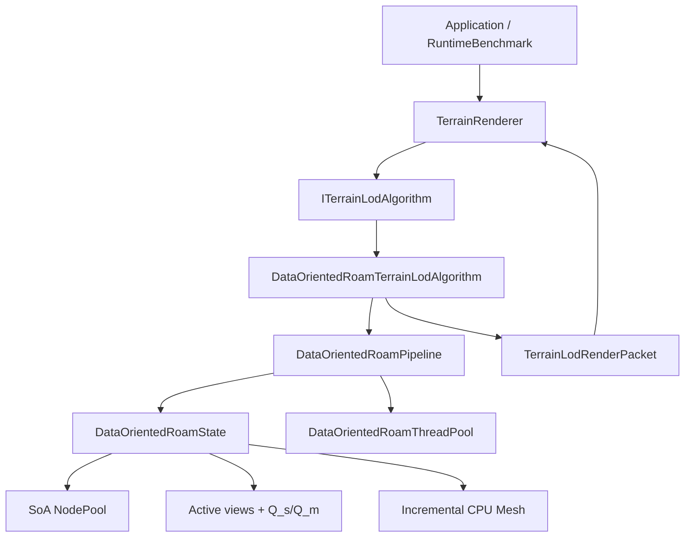
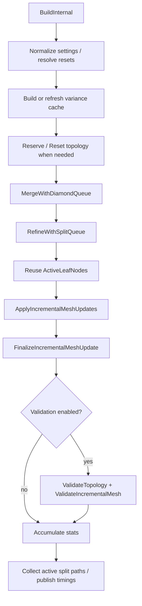

# Data-Oriented CPU ROAM 源码上下文

> 分析代码基线：提交 `078cb70603eb3a0a76dab14b81da9c12b3b3155d`，分析日期 2026-08-29。本文以当前主分支的实际执行代码为准；历史优化计划只用于解释演进过程，不反向推定最终实现。源码行号容易随后续提交变化，因此引用以文件和符号名为主。
>
> 配套阅读：[Classic CPU ROAM 源码上下文](classic_roam_context.md)给出对象式实现的完整基线；[CBT 2024 复现源码上下文](cbt_2024_reproduction_context.md)给出完全驻留 GPU 的对照路径；[DOD 与 Classic 优化问题规划](../parallel-roam/17-dod-classic-optimization-plan.md)记录优化过程；[最终实验数据分析与结论](../../benchmark-output/runtime-benchmark-final-analysis-20260828.md)提供本文使用的正式性能数据。
>
> 证据标签约定：
>
> - **源码事实：** 可以从当前代码直接确认。
> - **根据实现推断：** 由控制流、数据布局或公式推导出的结论，仍建议用运行或 profiler 验证。
> - **经典算法背景：** 用于帮助理解标准 ROAM，但不代表本项目已经实现。
> - **尚无法确认：** 静态代码或现有实验不足以作出结论。

## 1. 一页概览

**源码事实：** `Data-Oriented CPU ROAM`（下文简称 DOD）与 Classic 执行相同的二叉三角树、nested wedgie、屏幕误差、迟滞、forced split 和 diamond merge 语义。两者的主要差别不在 LOD 质量函数，而在状态表达和执行方式：Classic 用节点对象与裸指针保存拓扑，DOD 用稳定的 `uint32_t` 节点索引引用一组 SoA 数组，并为活动集合、双优先队列和 Mesh 槽位维护紧凑反向索引。

**源码事实：** DOD 不是“每帧扫描整棵树、重新生成整张 Mesh”的早期版本。当前实现跨帧保存：

- 节点池及历史 child；
- 稠密 `ActiveLeafNodes` 和 `ActiveInternalNodes`；
- 持久 split heap `Q_s` 与 merge heap `Q_m`；
- 上一帧 split path 迟滞集合；
- 稳定 dense triangle slots、node-to-slot 反向表和脏区间；
- 一个由 pipeline 持有的持久线程池。

普通 Build 的主顺序如下：

```text
准备/必要时 reset
  -> 刷新 Q_m 并执行低误差 merge
  -> 刷新 Q_s 并执行高误差 split / 预算 crossover
  -> 重放拓扑 edit 到增量 Mesh
  -> 可选拓扑与 Mesh 验证
  -> 发布统计、迟滞集合和借用式 CPU Mesh
```

| 结论 | 当前实现 |
| --- | --- |
| 公共接口 | `ITerrainLodAlgorithm` |
| 算法标识 | `TerrainLodAlgorithmId::DataOrientedCpuRoam` |
| 输出 | `TerrainLodRenderMode::CpuMesh`，借用持久 Mesh 到下一次 Build/Reset |
| 拓扑 | 两个根三角形构成 root diamond，节点索引邻接，child 在 merge 后保留 |
| 数据布局 | 数值/拓扑字段 SoA；动态 membership 为独立 24-byte sidecar |
| 细分队列 | `Q_s` 保存全部 active leaves；每帧批量刷新 priority，再 O(N) heapify |
| 合并队列 | `Q_m` 每个可合并 diamond 保存 canonical representative；成员局部维护 |
| 并行 | 评分、脏 Mesh emit，以及满足 8×8 chunk 局部安全条件的 split/merge commit |
| 正确性收尾 | 跨 chunk、需要新建 child 或 forced propagation 的事务回到串行实时队列收敛 |
| 预算 | 活动 leaf 硬上限；串行普通计数与并行 atomic token 分离 |
| Mesh | 稳定三角形槽位、拓扑 edit 重放、脏槽去重和连续上传 range |
| 当前性能 | 最终实验中默认平均帧比 Classic 低 26.15%，极限路径低 41.04% |

**根据实现推断：** “Data-Oriented”在这里不是把所有操作无条件并行化，而是先建立连续数据和显式索引，再把只读批量阶段和可证明不重叠的局部事务交给 worker。ROAM 邻接闭包仍有强依赖，所以跨 chunk 和 forced split 保留串行路径是当前正确性设计的一部分，而不是遗漏。

## 2. 模块在项目中的位置

### 2.1 统一接口与所有权

**源码事实：** `DataOrientedRoamTerrainLodAlgorithm final : public ITerrainLodAlgorithm` 是渲染系统能看到的适配器。它按值持有 `DataOrientedRoamPipeline` 和统一 `TerrainLodStats`。Pipeline 通过 `std::unique_ptr` 分别拥有 `DataOrientedRoamState` 与 `DataOrientedRoamThreadPool`，State 只借用线程池裸指针。



Pipeline 的 move constructor 和 move assignment 都会把 `state.ThreadPool` 重新绑定到移动后的 owner。这是必要的：默认移动 `unique_ptr` 只会移动对象所有权，不会自动修正 State 内部借用的地址。

### 2.2 Adapter 的能力声明

`DataOrientedRoamTerrainLodAlgorithm::Info` 返回：

- key：`data_oriented_cpu_roam`；
- 显示名：`Data-Oriented CPU ROAM`；
- 描述：`SoA CPU ROAM with batched screen-error evaluation`。

`Capabilities` 声明 CPU Mesh、split、merge、crack fix 和 topology validation；没有声明 GPU 工作。OpenGL 与 D3D12 renderer 都把它当作 CPU Mesh 算法消费，图形 API 只影响后续上传与绘制。

### 2.3 输入和输出边界

**源码事实：** `BuildRenderData` 将统一设置映射成 `DataOrientedRoamSettings`，调用 pipeline，然后发布：

- `BorrowedCpuMesh`：指向 pipeline 持久 Mesh；
- `CpuMeshLifetime = UntilNextBuildOrReset`；
- `CpuMeshGeneration`；
- `CpuMeshRequiresFullUpload`；
- 将三角形槽 range 乘以 3 后得到的 vertex/index 更新 range；
- 活动三角形数、索引数和统一统计。

无效 HeightMap 会在适配器边界返回失败，避免 benchmark 把空 Mesh 误判为低成本合法帧。CPU 利用率采样包围整个 pipeline Build。

## 3. 相关文件与职责

### 3.1 DOD 目录

| 文件 | 主要职责 |
| --- | --- |
| [`DataOrientedRoamTerrainLodAlgorithm.*`](../../src/algorithms/data_oriented_roam/DataOrientedRoamTerrainLodAlgorithm.cpp) | 统一接口适配、设置和统计映射、render packet |
| [`DataOrientedRoamPipeline.*`](../../src/algorithms/data_oriented_roam/DataOrientedRoamPipeline.cpp) | State/ThreadPool 所有权与单帧编排 |
| [`DataOrientedRoamTypes.h`](../../src/algorithms/data_oriented_roam/DataOrientedRoamTypes.h) | settings、stats、domain、Mesh range 等跨 pass 值类型 |
| [`DataOrientedRoamState.*`](../../src/algorithms/data_oriented_roam/DataOrientedRoamState.cpp) | SoA 节点池、活动集合、根节点、容量、reset、统计累积 |
| [`DataOrientedRoamQueues.*`](../../src/algorithms/data_oriented_roam/DataOrientedRoamQueues.cpp) | 持久 `Q_s/Q_m`、indexed heap、priority 刷新和局部 membership |
| [`DataOrientedRoamScoring.*`](../../src/algorithms/data_oriented_roam/DataOrientedRoamScoring.cpp) | domain split、nested wedgie、屏幕误差、迟滞和调试分类 |
| [`DataOrientedRoamTopology.*`](../../src/algorithms/data_oriented_roam/DataOrientedRoamTopology.cpp) | split/forced split/merge、chunk 分桶、并行提交与串行收敛 |
| [`DataOrientedRoamMeshEmit.*`](../../src/algorithms/data_oriented_roam/DataOrientedRoamMeshEmit.cpp) | 稳定 Mesh slot、edit 重放、脏槽 emit 和更新 range |
| [`DataOrientedRoamThreadPool.*`](../../src/algorithms/data_oriented_roam/DataOrientedRoamThreadPool.cpp) | 跨帧 worker、任务分发和 join |
| [`DataOrientedRoamValidation.*`](../../src/algorithms/data_oriented_roam/DataOrientedRoamValidation.cpp) | 拓扑、队列、membership 和增量 Mesh 不变量 |
| [`DataOrientedRoamCandidateMarking.*`](../../src/algorithms/data_oriented_roam/DataOrientedRoamCandidateMarking.cpp) | 候选分类辅助逻辑 |
| [`DataOrientedRoamStateOps.h`](../../src/algorithms/data_oriented_roam/DataOrientedRoamStateOps.h) | 小型状态操作和 active membership 查询 |
| [`DataOrientedRoamParallel.h`](../../src/algorithms/data_oriented_roam/DataOrientedRoamParallel.h) | 线程池调用包装 |

### 3.2 目录外直接依赖

DOD 直接复用项目公共的 `RoamNestedWedgie`、`RoamScreenError`、`RoamGeometry` 和 `RoamDebugVisualization`。这使 Classic 与 DOD 的几何切分、误差投影和调试颜色具有共同来源，而不是两份近似实现。

外围链路包括：

- `ITerrainLodAlgorithm.h`：公共输入、输出、能力和统计 schema；
- `TerrainRenderer` / `D3D12TerrainRenderer`：算法工厂、缓存、CPU range 上传和绘制；
- `ImGuiLayer`：算法选择、参数和运行时统计；
- `RuntimeBenchmark`：相同相机采样路径下的跨算法报告。

## 4. 初始化、重建与状态保留

### 4.1 首次 Build

`DataOrientedRoamPipeline::BuildInternal` 首先：

1. 将 `MaxDepth` 限制到 `[0, 20]`；
2. 将预算下限限制为两个根三角形；
3. 解析 nested wedgie 预计算深度；
4. 判断 topology reset 和 variance tree rebuild；
5. 复制设置、视图、地形尺度并清空本帧统计；
6. 令 `MergeThreshold <= SplitThreshold`；
7. 开始一次增量 Mesh 更新。

首次没有合法 root diamond，因此 reset 会清空节点池和所有持久索引，创建两个根节点，建立互为 `baseNeighbor` 的共享对角线，并把两根加入 active leaf view 和 `Q_s`。

### 4.2 根三角形与 PathId

两个 root 的 UV domain 是：

```text
Root A: (0,1), (1,0), (0,0)
Root B: (1,0), (0,1), (1,1)
```

`RootAPathId = 1`，`RootBPathId = 1 << 32`。两个根使用不同编号区间，child 通过确定性的左右路径编号派生，避免两棵树的迟滞 key 碰撞。

### 4.3 触发拓扑 reset 的变化

`NeedsTopologyReset` 只在以下条件返回 true：

- 首帧或根节点无效；
- `HeightMap` 对象地址变化；
- `MaxDepth` 比当前拓扑上限更小；
- `TriangleBudget` 变化；
- `TerrainSize` 或 `HeightScale` 变化。

提高 `MaxDepth` 不必丢弃当前 cut。如果新的 nested wedgie 预计算深度更大，pipeline 会重建 variance trees，并用 `RefreshNodeVarianceErrors` 更新历史节点缓存。阈值、相机、FOV 或 drawable 尺寸变化不会直接 reset，它们通过重新评分驱动现有拓扑收敛。

### 4.4 HeightMap 身份的含义

**源码事实：** 缓存身份按 `HeightMap*` 判断，而不是对像素内容做版本校验。如果调用方原地修改同一个 HeightMap 对象却不触发算法 Reset，静态阅读无法保证 variance cache 自动失效。当前正常应用链路切换高度图时会替换/重建相关状态。

## 5. 单帧更新流程

### 5.1 实际执行顺序



Merge 先于 split 执行，目的是先回收远处旧细节。Split 阶段不仅处理细分；当硬预算不足而 `Q_s` 队首价值高于 `Q_m` 队首时，它还会在 crossover 中继续 merge，为高价值 split 腾出 token。

### 5.2 不再存在的独立 pass

**源码事实：** 当前 DOD 不再为预算或最终输出递归收集 leaf：

- 预算直接由准确的 `ActiveLeafNodes.size()` / `Q_s` membership 计算；
- 最终 Mesh 与统计直接借用 `ActiveLeafNodes`；
- `BudgetLeafCollectMilliseconds` 和 `FinalLeafCollectMilliseconds` 固定为 0；
- 旧 `ErrorEvaluationSingleThreadMilliseconds` / `ParallelMilliseconds` 字段保留 schema 兼容，但评分时间已归入 `Q_s/Q_m` refresh 对应阶段。

这点与历史 DOD 文档中“每帧 collect/全量 emit”的描述不同，阅读 profiler 或 CSV 时不能把兼容字段当成仍存在的独立工作。

## 6. 核心数据结构

### 6.1 SoA NodePool

`DataOrientedRoamNodePool` 不为每个节点创建一个大对象，而是为每个字段保存独立 `std::vector`：

- 几何：`Domains`；
- 层级：`Parents`、`LeftChildren`、`RightChildren`、`Depths`；
- 邻接：`BaseNeighbors`、`LeftNeighbors`、`RightNeighbors`；
- 并行归属：`InteriorChunkIds`；
- 误差：`GeometricErrors`、`ScreenErrors`、`VarianceIndices`、`VarianceTreeIndices`；
- 身份和历史：`PathIds`、创建/激活/split/merge build id；
- 调试和状态：`DebugTopologyEvents`、`ActivatedByForcedSplits`、`IsSplits`。

`DataOrientedRoamNodeIndex` 是 `uint32_t`，无效值取数值上限。拓扑关系因此不依赖 vector 元素地址；节点池扩容不会让 parent/neighbor 引用悬空。

`DataOrientedRoamNodeRef` 与 `DataOrientedRoamNodeConstRef` 只是把同一索引的多个数组元素临时聚合成引用视图，不拥有数据，也不应跨会引起 vector 扩容的操作保存。

### 6.2 Membership sidecar

`DataOrientedRoamNodeMembership` 包含六个 32 位字段：

```text
ActiveInternalPosition
ActiveLeafPosition
SplitQueuePosition
MergeQueuePosition
MergeQueueRepresentative
MergeQueuePartner
```

结构有静态大小断言，当前为 24 bytes/node。它把频繁变化的集合位置和队列反向索引放在连续 sidecar 中，没有把这些字段重新混入数值 SoA，也避免早期多组 64 位旁路数组的空间和随机访问成本。

### 6.3 活动集合

`ActiveLeafNodes` 与 `ActiveInternalNodes` 都是稠密索引数组，使用 membership position 实现 O(1) swap-remove。它们是集合视图，顺序不表达 priority。

尤其是 `ActiveLeafNodes` 已与 `Q_s` 分离：heap swap 或 heapify 只改变 `SplitQueue`，不会重排最终 Mesh 的活动叶视图。验证模式会在 priority refresh 前后比较活动叶顺序，防止两种职责重新耦合。

### 6.4 历史 child 复用

首次 split 才为 parent 创建左右 child。merge 只把 child 从活动 cut 中移除，不删除节点，也不清空 parent 的 child index。随后再次 split 可以复用历史节点、PathId、variance index 和预分配存储。

代价是 `NodeCount` 表示历史节点池规模，不等于当前活动节点数；UI 或 benchmark 不能把二者混为一谈。

## 7. 几何表示与坐标转换

### 7.1 TriangleDomain

每个节点保存三个 UV 点 `A/B/C`。公共 `Roam::SplitTriangleDomain` 使用 base midpoint 把一个三角形切为左右 child；DOD 的 `SplitTriangleDomain` 只做类型适配。因此 DOD 与 Classic 的二分几何完全共源。

直到 emit 时，UV 才通过 HeightMap、`TerrainSize` 和 `HeightScale` 转成世界空间位置。每个活动叶输出三个独立顶点和三个局部索引，没有跨三角形顶点去重。

### 7.2 深度与容量

`MaxDepth` 是拓扑深度硬上限，pipeline 最大支持 20。节点池 reserve 在可精确计算的深度内按完整二叉树容量估算；预留只是性能优化，正确性依赖索引而非地址稳定。

活动三角形预算与历史节点池容量不同：一个 split 净增加一个 active leaf，merge 一个 parent 净减少一个；历史 child 保留会让 NodePool 大于当前预算。

## 8. Nested Wedgie 与屏幕误差

### 8.1 两棵预计算树

**源码事实：** DOD 为两个 root 分别调用公共 `Roam::BuildNestedWedgieTree`。叶层 thickness 为 0，父节点使用左右子树最大厚度再叠加当前 base midpoint displacement。预计算深度由 HeightMap 分辨率、请求 `MaxDepth` 和实现上限共同解析。

每个拓扑节点保存 `VarianceTreeIndex` 与 heap-style `VarianceIndex`，左右 child 分别派生为 `2i+1` 和 `2i+2`。`GeometricError` 缓存在节点 SoA 中。

### 8.2 屏幕空间评分

`ComputeScreenErrorScore` 执行以下步骤：

1. `GeometricError * HeightScale` 得到世界空间误差厚度；
2. 将 domain 三顶点采样为世界空间三角形；
3. 将三角形、厚度、ViewProjection、六个视锥面、drawable 尺寸传给公共 `Roam::ComputeScreenErrorScore`；
4. 视锥外节点得到不会推动 split 的评分，近平面情况由公共保守投影处理。

**结论：** DOD 的质量标准与 Classic 相同。性能差异不能解释为 DOD 使用了更宽松的误差公式。

### 8.3 Split/Merge 迟滞

`ShouldSplitWithScore` 的语义是：

- `score > SplitThreshold`：split；
- `score < MergeThreshold`：不 split；
- 中间迟滞区：查看该 `PathId` 是否存在于 `PreviousSplitPaths`。

Pipeline 会强制 `MergeThreshold <= SplitThreshold`，避免阈值反转造成同帧展开/回收抖动。最终 active topology 完成后才重建 `CurrentSplitPaths` 并交换到上一帧集合。

## 9. 持久 Split Queue `Q_s`

### 9.1 成员语义

**源码事实：** `Q_s` 保存全部 active leaves，不只保存当前超过 split 阈值的叶子。达到最大深度、当前无法提交或本帧被 block 的节点仍可保有 membership，只是 score 被设成不可 split 的极小值。

每项是 `{Score, Node}`，node membership 保存 heap position。任意 forced split 可以按 node O(1) 找到位置，再用 swap-remove 和上下 sift 做 O(log N) 删除，不受“只能弹队首”的 `priority_queue` 限制。

相同 score 使用稳定 `PathId` 决定先后，降低因内存布局或 worker 调度造成的非确定排序。

### 9.2 每帧 priority refresh

相机变化会让所有 score 失效，但不会让 active leaf membership 失效。`RefreshPersistentSplitQueuePriorities`：

1. 把 heap entry 划成互不重叠的连续区间；
2. worker 只读拓扑并写各自 entry score；
3. 所有 worker 完成后，在主线程自底向上 O(N) heapify；
4. 用活动叶数同步串行和并行预算 token。

小于 256 项或 worker 设置为 1 时串行刷新；自动模式最多使用 8 个 worker。默认不把 score 镜像回 NodePool，避免每帧多一组随机 SoA 写入。

### 9.3 当前 Build 的 block

约束闭包失败但节点仍是合法 active leaf 时，不能把它永久移出 `Q_s`。实现通过 `SplitQueueBlockedBuildIds` 标记当前 Build，并把该 entry 临时沉到 heap 尾部；下一帧 priority refresh 会重新评价。

## 10. 持久 Merge Queue `Q_m`

### 10.1 Canonical diamond

一个完整 diamond 可能由两侧 parent 表示，但 `Q_m` 只保存 canonical representative，并在 membership 中记录 representative/partner，避免同一 diamond 被重复入队和重复 merge。

边界上没有对侧 internal parent 时允许单侧 merge；有对侧时必须互为 base neighbor 且两边 child 都是 leaf，才能执行完整 diamond merge。

### 10.2 局部 membership 维护

Reset 时可以扫描一次全部 active internal nodes 初始化 `Q_m`。正常 topology edit 只收集受影响节点、亲属、直接邻居及必要的 parent/base 邻域，先 invalidation，再在提交后 refresh。刚变为可合并的父节点会在同一 Build 内进入队列，因此 merge 可以向上级联。

### 10.3 Priority refresh

每帧只重算现有 `Q_m` 成员，不扫描所有 active internal nodes。与 `Q_s` 一样，达到 256 项后可将 heap entry 区间分给最多 8 个 worker，完成后 O(M) heapify。

**根据实现推断：** 这正是最终实验中 DOD merge mark 明显快于 Classic 的主要结构基础之一；具体收益仍包括缓存行为、节点分布和相机路径，不能只由复杂度公式给出。

## 11. Split、Forced Split 与硬预算

### 11.1 一个 split 的事务

`SplitNodeImpl` 由串行和并行 `CommitPolicy` 共享，核心步骤是：

1. 验证 node 是 leaf 且未到 `MaxDepth`；
2. 先获取一个预算 token，因为一个 leaf 变两个 leaf，净增一片；
3. 开启局部约束时，沿 base-neighbor 关系完成 forced split 闭包；
4. 首次 split 创建 child，再次 split 复用历史 child；
5. 使 parent 变 internal，清理/重建 child 邻接；
6. 更新 active views、`Q_s/Q_m` 邻域与 Mesh edit；
7. 记录 requested/forced split 统计。

forced propagation 的 guard 是 `MaxDepth + 2`。任一必要闭包失败时，当前 split 释放已获取 token 并失败，防止出现超过预算或一侧粗边对多侧细边的半提交状态。

### 11.2 两种预算计数

串行路径使用普通 `RemainingSerialSplitBudget`，避免为主线程事务支付 atomic 成本。并行 worker 使用 `RemainingParallelSplitBudget` 的原子 token。并行 join 后调用 `SynchronizeSerialSplitBudget` 一次，把剩余预算恢复到普通计数；后续串行收敛不再访问原子变量。

**源码事实：** 并行 split worker 只对已经存在可复用 child 的节点提交。首次需要扩容 NodePool 的 split 留给串行路径，从而避免多个 worker 同时修改 SoA vectors。

## 12. Diamond Merge 与预算交换

### 12.1 Merge 事务

`MergeSingleNodeImpl` 将两个 active leaf child 退出 cut，让 parent 恢复为 leaf，并把外部 neighbor 从 inactive child 改回 parent。每合并一个 parent 释放一个预算 token；完整 diamond 同时处理两侧 parent，因此释放两个。

merge 不删除 child，也不回收 NodePool index。它只改变 active cut 和邻接，使后续相机回近时可以低成本复用历史拓扑。

### 12.2 每帧先 Merge

`MergeWithDiamondQueue` 的顺序是：刷新 `Q_m` priority、快照低于 merge 阈值的候选、按 score 升序分 chunk 并尝试并行提交，最后持续消费实时 `Q_m` 做串行收敛。

### 12.3 Split 阶段中的 crossover

并行 split 预提交后，实时双队列循环优先处理明确低于 merge 阈值的节点。随后检查 `Q_s` 队首：

- 可以 split 时直接提交；
- 因预算闭包失败且 `splitScore > mergeScore` 时，先 merge 损失较低的 diamond，再重试 split；
- 没有更低价值的 merge 可回收时，当前硬预算下达到稳定状态；
- 非预算原因的闭包失败则只 block 当前 split 到下一帧。

因此 DOD 不是两个互不相干的“先 merge 后 split”循环，而是在 split 收敛阶段仍保持全局 `Q_s/Q_m` 价值交换。

## 13. 8×8 Topology Chunk 并行提交

### 13.1 Chunk 划分

节点创建时按 UV domain 缓存 `InteriorChunkId`。地形被固定划分为 `8 × 8 = 64` 个 chunk；跨越 chunk 边界、无法唯一归属内部区域的节点记为 boundary candidate。

并行 split 默认至少需要 32 个候选，并行 merge 默认至少需要 160 个候选；还必须至少有两个非空 chunk。自动 worker 数最多 8，并受非空 chunk 数限制。

### 13.2 Split 的安全条件

一个 split 只有同时满足以下条件才进入并行 interior batch：

- 当前是 leaf，未到最大深度；
- 已有可复用的左右 child，不需要 worker 分配节点；
- 不需要 forced base-neighbor propagation；
- parent、children、左右外邻居都属于同一 chunk；
- 若 diamond 对侧已 split，对侧 parent 与 children 也属于同一 chunk。

任何条件不满足都回到实时 `Q_s` 串行处理。并行候选是不可变快照，worker 提交后仍必须检查当前拓扑是否有效，因为同批更高优先级事务可能让快照过期。

### 13.3 Merge 的安全条件

并行 merge 要求 parent 的两个 child 都是 leaf，diamond 对侧也处于可回收形态；parent、children、外侧被改写的 neighbor，以及完整 diamond 对侧涉及的节点必须属于同一 chunk。否则留给串行 `Q_m` 收敛。

### 13.4 Worker 写入边界

一个 chunk 在一个 phase 内只由一个 worker 处理，chunk 内候选按 priority 顺序提交，不同 chunk 可并行。Worker 可以修改已经证明不重叠的 topology 字段，但不直接修改以下共享容器：

- active leaf/internal vectors；
- `Q_s/Q_m` heap 结构；
- Mesh slots 和 edit list；
- 全局统计字段。

每个 worker 记录本地 counters 和 committed results。Join 后主线程统一应用 active index transition、队列邻域刷新、Mesh edit 和统计合并。调试事件字节可能由相邻内部事务触达，因此使用 `atomic_ref<uint8_t>` 做松散覆盖。

### 13.5 诊断环境变量

源码提供三项只服务独立 benchmark 配对实验的覆盖：

- `PARALLEL_ROAM_DOD_MIN_PARALLEL_COMMIT_CANDIDATES`；
- `PARALLEL_ROAM_DOD_PARALLEL_COMMIT_BUILD`；
- `PARALLEL_ROAM_DOD_PARALLEL_COMMIT_PHASE`。

未设置时使用产品默认阈值。它们不是 UI 设置，也不应作为正常运行所依赖的参数。

## 14. 持久线程池

`DataOrientedRoamThreadPool` 由 pipeline 跨帧持有，避免每个评分或 emit pass 反复创建系统线程。线程池可以为更大的并行宽度扩展 worker，但不会为了后续小任务主动缩小。

当前可并行阶段主要是：

- `Q_s/Q_m` priority refresh；
- 安全 interior split/merge commit；
- 脏 Mesh triangle emit。

这些阶段一般在任务少于 256 项时保持串行，topology commit 使用独立的 32/160 候选阈值。`ErrorEvaluationWorkerCount = 0` 表示自动选择，统一适配器当前固定使用自动模式；设置为 1 可禁止这些自动并行路径。

**根据实现推断：** 持久线程池降低了线程创建成本，但并行是否获益仍取决于候选数、非空 chunk 数、拓扑边界比例和每项工作量。源码中的阈值是当前产品策略，不是算法常数。

## 15. 增量 Mesh

### 15.1 稳定 dense slot

`DataOrientedRoamIncrementalMesh` 保存：

- `Data`：持久顶点和索引；
- `NodeSlots`：node -> triangle slot；
- `SlotOwners`：dense triangle slot -> active leaf；
- `SlotDirtyGenerations` 与 `DirtySlots`；
- `UpdateRanges`；
- `TopologyEdits` 与 `DebugTransitionLeaves`；
- generation、full-upload 和 initialization 标志。

每个活动 leaf 恰好占一个 dense slot。`NodeSlots` 是反向索引，不属于 queue membership sidecar，因为 Mesh 生命周期与队列位置是不同职责。

### 15.2 Split 和 merge 的槽位变换

拓扑阶段不直接写 Mesh，而是按提交顺序记录 edit：

- split：左 child 继承 parent slot，右 child 追加到末尾；
- merge：parent 继承保留 child slot，被移除 child 使用 move-last 压紧 dense slots。

按顺序重放很重要：同一 Build 内可能发生级联 split/merge，只有依次把上一代 cut 变换到最终 active cut，node-slot 关系才保持一致。

如果 edit 重放发现前置 slot 关系不成立，实现会回退到用当前 `ActiveLeafNodes` 完整初始化 Mesh。该 fallback 是正确性保险，不是按 dirty 比例选择的性能策略。

### 15.3 Dirty emit 与 range

脏槽使用 generation 去重，随后排序。少于 256 个脏三角形时串行 emit；更大批次可分给最多 8 个 worker，每个 worker 写独立 slot 的三个顶点和三个索引。

Finalize 只把物理连续的 dirty slots 合并为 range，不跨空洞扩大上传。首次初始化或 fallback 会发布单个完整范围并设置 `RequiresFullUpload`；普通帧发布局部 range。Adapter 再把 triangle range 转为统一 vertex/index range。

### 15.4 当前没有 dirty-ratio 自动全量策略

**源码事实：** 即使 dirty slots 占活动 Mesh 的比例很高，当前代码也不会因为比例阈值主动切换到另一条全量 emit 算法；它仍对 dirty list 分段并行。只有初始化、reset 或 edit replay 失败才要求完整上传。

这意味着“DOD 已有增量 Mesh”是事实，“DOD 已经实现增量/全量自适应选择”则不是。

### 15.5 本帧 LOD 调试着色

节点的 `DebugTopologyEvent` 记录 split/merge 事件。Mesh finalize 会保存当前可见 transition leaves；下一次 Build 开始时先把上次事件对应槽位重新标脏，以便恢复普通深度颜色，再写入本帧新事件。

公共调试颜色中 split 为红色、merge 为绿色。邻接传播本身不生成独立 Mesh edit，但被写入事件的稳定叶仍会进入 dirty 集合，因此能通过局部上传更新颜色。

## 16. 正确性不变量与验证

### 16.1 拓扑不变量

`ValidateTopology` 覆盖的核心关系包括：

- 两个 root 合法且构成预期 root diamond；
- active leaf/internal 集合与 `IsSplit` 状态一致，无重复与越界；
- parent-child 双向关系一致；
- base/left/right neighbor 引用合法且满足对应关系；
- 活动 cut 不引用已失活 child 作为外部邻居；
- split 节点具有合法 child，child 能反查到 parent，非 root 节点具有合法 parent；
- 局部约束开启时没有 T-junction 风险；
- `Q_s/Q_m` heap、position、representative 和 partner membership 一致。

Validator 只报告问题，不自动修补拓扑。关闭 `EnableLocalConstraints` 会改变裂缝约束语义，不能依赖 validator 把裂缝补回来。

### 16.2 增量 Mesh 不变量

`ValidateIncrementalMesh` 检查：

- `SlotOwners.size()` 等于活动叶数；
- owner 是合法 active leaf，且 `NodeSlots[owner]` 指回当前 slot；
- 顶点/索引数量与每槽三个元素匹配；
- 局部索引指向对应三顶点；
- 顶点 UV 和当前 domain 一致；
- update range 不越界，range 覆盖量与 updated 统计一致；
- `updated + reused == active`。

这些检查使拓扑正确与输出正确分开：一棵邻接合法的树仍可能因 slot replay 错误输出错误 Mesh，所以两类 validator 都需要。

### 16.3 并行不变量

并行正确性建立在三条边界上：不同 worker 写不同 chunk；共享 vectors/heap/slots 只由 join 后主线程修改；并行预算使用 atomic token。静态 chunk 判定是保守充分条件，不声称找出所有可并发事务。

## 17. 参数、统计与运行时链路

### 17.1 设置映射

| 统一设置 | DOD 设置 | 语义 |
| --- | --- | --- |
| `MaxDepth` | `MaxDepth` | 最大拓扑深度，最终限制到 20 |
| split pixel threshold | `SplitThreshold` | 高于它请求 split |
| merge pixel threshold | `MergeThreshold` | 低于它请求 merge |
| `TriangleBudget` | `TriangleBudget` | active leaf 硬上限，最小 2 |
| `EnableParallelSplit` | 同名字段 | 是否创建 split 快照和执行 chunk 预提交 |
| `EnableLocalConstraints` | 同名字段 | 是否执行 base-neighbor forced closure |
| `EnableTopologyValidation` | 同名字段 | 是否运行拓扑和 Mesh validator |

评分 refresh 的并行不受 `EnableParallelSplit` 关闭影响；该开关只跳过 split candidate 快照、分桶和 chunk commit，保留实时 `Q_s` 串行收敛。

### 17.2 统计分层

DOD 原生统计分成：

- 规模：历史节点、active triangles、队列成员、Mesh slots；
- 操作：split、forced split、merge、拒绝和 crossover；
- 并行：候选、非空 chunk、worker、parallel commit；
- Mesh：full rebuild、updated、reused、dirty ranges；
- 正确性：T-junction、invalid neighbor/topology；
- 时间：prepare、merge mark/topology、split scan/topology、emit、validate、finalize；
- topology 六段细分：chunk build、queue invalidation、parallel commit、result merge、index/queue refresh、serial convergence。

Adapter 映射到 `TerrainLodStats` 后，UI、CSV 和 Markdown benchmark 使用同一 schema。`CpuWorkerCount` 是本帧所有 CPU pass 所用最大并行宽度，不是进程线程总数。

### 17.3 UI 与 renderer

算法选择框通过统一算法工厂创建 DOD。运行时面板读取统一 Stats，CPU Mesh renderer 根据 `CpuMeshRequiresFullUpload` 和 ranges 决定完整或局部上传。DOD 不需要图形后端专属拓扑代码，因此 OpenGL 和 D3D12 应得到同一 CPU cut；差异只出现在上传 API 和绘制后端。

### 17.4 Benchmark

无窗口 DOD 回归验证算法契约；应用级 runtime benchmark 每帧主动请求更新，在同一离散相机路径、参数和渲染条件下依次测试可用算法。正式性能结论必须同时查看三角形工作量、CPU update、上传、阶段分解与尾延迟，而不能只看平均 FPS。

## 18. 性能特征与最终实验

### 18.1 可比工作量

最终 Release/D3D12 报告中，默认路径 Classic 和 DOD 的平均三角形数均为 `18758.02`；极限路径分别为 `200000.00` 和 `199999.44`，差异约 `-0.0003%`。因此下面的性能差异不是靠 DOD 显著减少输出三角形得到的。

### 18.2 总帧与尾延迟

| 路径 | 指标 | Classic | DOD | DOD 相对 Classic |
| --- | --- | ---: | ---: | ---: |
| 默认 | 平均 | 4.720 ms | 3.486 ms | -26.15% |
| 默认 | P95 | 6.639 ms | 5.112 ms | -23.00% |
| 默认 | P99 | 8.634 ms | 6.250 ms | -27.61% |
| 极限 | 平均 | 201.846 ms | 119.017 ms | -41.04% |
| 极限 | P95 | 225.289 ms | 141.885 ms | -37.02% |
| 极限 | P99 | 234.723 ms | 158.894 ms | -32.31% |

**源码事实与实验事实的边界：** 源码能解释可能的收益来源，不能单独证明上述百分比。百分比来自 2026-08-28 最终报告的五组样本合并结果，只对该机器、分辨率、路径、参数和构建配置成立。

### 18.3 CPU 分阶段

| 路径 | 阶段 | Classic avg | DOD avg | 变化 |
| --- | --- | ---: | ---: | ---: |
| 默认 | Merge mark | 0.6108 ms | 0.2348 ms | -61.56% |
| 默认 | Merge topology | 0.0942 ms | 0.1692 ms | +79.65% |
| 默认 | Split scan | 1.9273 ms | 0.5894 ms | -69.42% |
| 默认 | Split topology | 0.2099 ms | 0.3127 ms | +48.99% |
| 默认 | Mesh emit | 0.1915 ms | 0.2355 ms | +23.02% |
| 极限 | Merge mark | 15.0103 ms | 2.8396 ms | -81.08% |
| 极限 | Merge topology | 18.7172 ms | 23.2098 ms | +24.00% |
| 极限 | Split scan | 47.0477 ms | 6.7338 ms | -85.69% |
| 极限 | Split topology | 32.5351 ms | 32.7184 ms | +0.56% |
| 极限 | Mesh emit | 27.2397 ms | 11.6421 ms | -57.26% |

结论不是“DOD 每个阶段都更快”。连续队列成员和批量 priority refresh 让扫描阶段大幅下降；默认路径的 topology commit 反而支付更多索引、队列和结果整理成本。负载升高后，DOD 的 Mesh emit 和 finalize 获得明显规模收益，整体优势扩大。

### 18.4 当前瓶颈

极限路径中：

- DOD split topology 的 `32.7184 ms` 几乎全部是串行收敛；
- merge topology 的串行收敛为 `17.2773 ms`，占 `74.44%`；
- merge index/queue refresh 为 `4.2820 ms`，占约 `18.45%`；
- DOD split topology P99 为 `63.533 ms`，高于 Classic 的 `42.650 ms`。

**根据实现推断：** 继续优化大块 score 扫描的边际收益已经有限。更值得 profiling 的位置是跨 chunk/forced split 串行链、merge 邻域 membership 更新、并行批次的整理成本，以及高 dirty 比例时是否需要显式全量 emit 策略。

## 19. 与 Classic 的对照

| 维度 | Classic | DOD |
| --- | --- | --- |
| 节点引用 | 裸指针 | `uint32_t` index |
| 节点布局 | AoS 节点对象 | 多数组 SoA |
| 动态 membership | 节点内 intrusive 字段 | 24-byte sidecar |
| 活动叶 | 持久集合 | 独立稠密 `ActiveLeafNodes` |
| `Q_s/Q_m` | 持久 indexed heap | 持久 indexed heap |
| 评分公式 | 公共 nested wedgie / screen error | 同一公共实现 |
| 拓扑规则 | forced split、diamond merge | 相同规则和公共 domain split |
| 执行 | 单线程 | 批量评分、局部并行 commit、串行收敛 |
| 节点分配 | 对象式存储 | SoA append，worker 不做首次 child 分配 |
| Mesh | 稳定 dense slot 与 dirty range | 稳定 dense slot 与 dirty range |
| 输出模式 | CPU Mesh | CPU Mesh |
| 主要优点 | 事务直接、结构容易对应论文 | 连续扫描、显式索引、多核阶段和规模扩展 |
| 主要代价 | 指针追逐、单线程扫描 | membership/heap/index 维护与并行整理 |

**经典算法背景：** 两者都属于本项目对连续二叉三角树 ROAM 的工程实现，而不是 ROAM 1997 所有优化和全局最优性证明的逐项复刻。持久双队列的最终 priority、硬预算、增量输出格式和 chunk 并行策略是项目实现选择。

## 20. 最小逐帧手算示例

假设初始预算为 6，两根三角形 `A/B` 都是 active leaf，`A` 与 `B` 互为 base neighbor，局部约束开启：

```text
ActiveLeafNodes = [A, B]
Q_s = {A, B}
Q_m = {}
remaining budget = 4
```

### 20.1 第一帧：请求 A split

若 `score(A) > splitThreshold`，但 `B` 仍是 leaf，A 的 split 需要 forced split B：

1. A 预留一个 token；
2. B forced split 再预留一个 token；
3. B 创建 `B0/B1`，B 变 internal；
4. A 创建 `A0/A1`，A 变 internal；
5. 两侧 child 重新连接为无裂缝 diamond；
6. active leaves 从 2 变 4，剩余预算从 4 变 2；
7. `Q_s` 删除 A/B、加入四个 child；
8. `Q_m` 局部刷新后加入一个 canonical diamond representative；
9. Mesh 重放两个 split edit：每侧一个 child 继承旧 slot，另一个 child 追加。

### 20.2 第二帧：预算已满但更重要节点出现

继续细分到 6 片后预算 token 为 0。若新的 `Q_s` 队首 `S` 仍要求 split，而 `Q_m` 队首 `M` 的损失更低：

```text
splitScore(S) > mergeScore(M)
```

串行 crossover 会先 merge `M`，释放一个或两个 token，再尝试 `S` 的 requested/forced closure。若没有低于 `S` 的可回收 diamond，算法停止在当前预算下的稳定 cut，而不是突破预算。

### 20.3 Mesh range

如果最终只修改槽 1、2 和 5，generation 去重/排序后发布：

```text
triangle ranges = [1, count 2], [5, count 1]
vertex ranges   = [3, count 6], [15, count 3]
index ranges    = [3, count 6], [15, count 3]
```

Renderer 只上传这两个物理连续区间。首次 Build 则发布覆盖所有活动三角形的单个完整范围。

## 21. 文件与符号索引

### 21.1 入口与生命周期

| 符号 | 文件 | 用途 |
| --- | --- | --- |
| `DataOrientedRoamTerrainLodAlgorithm` | `DataOrientedRoamTerrainLodAlgorithm.*` | 公共 adapter |
| `BuildRenderData` | 同上 | 设置映射、Build、packet 与统计 |
| `DataOrientedRoamPipeline` | `DataOrientedRoamPipeline.*` | State/ThreadPool owner |
| `BuildInternal` | 同上 | 完整帧编排 |
| `NeedsTopologyReset` | `DataOrientedRoamState.cpp` | 持久拓扑失效判断 |
| `ResetTopology` | 同上 | 创建 root diamond 与初始队列 |

### 21.2 评分与队列

| 符号 | 文件 | 用途 |
| --- | --- | --- |
| `RebuildVarianceTrees` | `DataOrientedRoamScoring.cpp` | 构建两棵 nested wedgie tree |
| `ComputeScreenErrorScore` | 同上 | 公共保守屏幕误差入口 |
| `ShouldSplitWithScore` | 同上 | split/merge 阈值与迟滞 |
| `RefreshPersistentSplitQueuePriorities` | `DataOrientedRoamQueues.cpp` | 批量刷新 `Q_s`、heapify 和预算 |
| `RefreshPersistentMergeQueuePriorities` | 同上 | 批量刷新 `Q_m` |
| `RefreshPersistentMergeQueueNeighborhood` | 同上 | topology edit 后局部修复 membership |

### 21.3 拓扑与并行

| 符号 | 文件 | 用途 |
| --- | --- | --- |
| `SplitNodeImpl` | `DataOrientedRoamTopology.cpp` | 串/并行共用 split 事务 |
| `MergeNodeOrDiamondWithScoreLimitImpl` | 同上 | 串/并行共用 merge 事务 |
| `SafeInteriorSplitChunkId` | 同上 | split 并行安全判定 |
| `SafeInteriorMergeChunkId` | 同上 | merge 并行安全判定 |
| `RefineWithSplitQueue` | 同上 | split 快照、并行预提交、crossover 和收敛 |
| `MergeWithDiamondQueue` | 同上 | merge refresh、并行预提交和收敛 |

### 21.4 Mesh 与验证

| 符号 | 文件 | 用途 |
| --- | --- | --- |
| `BeginIncrementalMeshUpdate` | `DataOrientedRoamMeshEmit.cpp` | 开始 generation、恢复上帧调试色 |
| `RecordMeshSplit` / `RecordMeshMerge` | 同上 | 记录有序 topology edit |
| `ApplyIncrementalMeshUpdates` | 同上 | 重放 edit 或 fallback 初始化 |
| `FinalizeIncrementalMeshUpdate` | 同上 | 生成 ranges 和 Mesh 统计 |
| `ValidateTopology` | `DataOrientedRoamValidation.cpp` | 拓扑、队列和 membership 验证 |
| `ValidateIncrementalMesh` | 同上 | slots、owners、数据与 ranges 验证 |

相对仓库根目录，上表文件都位于 [`src/algorithms/data_oriented_roam`](../../src/algorithms/data_oriented_roam/)。

## 22. 已知边界、待确认项与建议诊断

### 22.1 已知实现边界

- 并行 topology 只覆盖保守 interior 子集，不是全拓扑 lock-free 算法；
- 首次创建 child、forced propagation 和跨 chunk 事务保持串行；
- 8×8 grid、32/160 候选阈值和最多 8 worker 是当前经验策略；
- 历史节点不回收，长时间访问大量不同细节区域时 NodePool 只增不减，直到 Reset；
- 增量 Mesh 没有按 dirty ratio 自动选择全量 emit；
- CPU Mesh 每个三角形使用三个独立顶点，没有顶点共享；
- `EnableLocalConstraints=false` 是实验能力，不能保证无 T-junction；
- HeightMap 缓存按对象地址识别，不检测同对象的原地像素修改。

### 22.2 静态阅读不能确认

**尚无法确认：** 仅凭源码不能确定以下问题：

- 8×8 是否是不同 CPU、预算和地形下的最佳 chunk grid；
- 32/160 与 256 三组阈值是否在所有硬件上都处于收益交叉点；
- NodePool 长期增长在真实开放世界相机路径中的峰值；
- dirty ratio 多高时全量连续 emit/upload 会胜过离散 ranges；
- 默认路径 DOD 轮间 CV 高于 Classic 的具体系统原因；
- 极限 split topology P99 尖峰由哪一种 forced/cross-chunk 链主导。

### 22.3 建议继续 profiling 的位置

1. 给串行 split convergence 按失败原因、forced closure 长度和跨 chunk 类型分桶；
2. 记录 merge neighborhood 中访问节点数、失效项数和实际入队数；
3. 对不同 dirty ratio 比较局部 emit/range upload 与完整连续 emit/upload；
4. 对 4×4、8×8、16×16 grid 做相同事务流的配对实验；
5. 将 topology P99 与队列队首变更次数、crossover 次数和 forced split 深度相关联；
6. 记录历史 NodePool 高水位、active/history 比例与内存字节数。

### 22.4 当前定向验证入口

与本文最直接相关的 CTest 是：

- `roam_budget_reentry_dod`：硬预算、merge 回收和重新进入 split；
- `roam_split_queue_view_dod`：活动叶视图与 split heap 分离；
- `roam_incremental_mesh_emit_dod`：稳定 slot、局部 range 和复用统计。

完整正确性还依赖共享 nested wedgie、屏幕投影、Terrain LOD view/contract 和应用 smoke 测试。源码分析文档不能替代这些自动验证，也不应把一次 benchmark 无错误等同于形式化证明。
